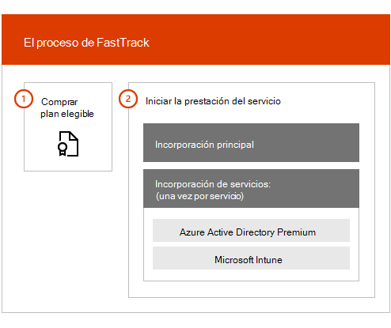

# Información general sobre las ventajas del Centro de FastTrack

Con las ventajas del Centro de FastTrack para Microsoft Azure Active Directory Premium, Microsoft Intune y Azure Information Protection, trabajará de forma remota con especialistas de FastTrack para preparar su entorno y planear su implementación y uso en la organización. Para obtener más información sobre la idoneidad, vea el [Proceso de las ventajas del Centro de FastTrack para Enterprise Mobility + Security (EMS)](EMS-fasttrack-process.md).

La incorporación consta de dos componentes principales:

-   **Incorporación principal**: tareas necesarias para la configuración de espacios empresariales y la integración con Azure Active Directory, si es necesario. La incorporación principal también proporciona la base de referencia para incorporar otros servicios pertinentes de Microsoft Online.

-   **Incorporación de servicio**: tareas necesarias para configurar cualquiera de las variantes independientes de la carga de trabajo de EMS (Azure AD Premium, Intune y Azure Information Protection).

En el siguiente diagrama se describen las fases de incorporación de alto nivel de las ventajas del Centro de FastTrack.

A continuación, se muestra cómo funciona el proceso:

- El Centro de FastTrack intentará ponerse en contacto con usted para ofrecer asistencia en la incorporación, después de que compre las licencias de un servicio pertinente. También puede solicitar ayuda al [Centro de FastTrack](https://go.microsoft.com/fwlink/?linkid=780698) si está listo para implementar estos servicios en la organización. Para solicitar asistencia, inicie sesión en el [Centro de FastTrack](https://go.microsoft.com/fwlink/?linkid=780698) con su cuenta profesional o educativa, vaya al panel, expanda el vínculo **¿Necesita ayuda?** en la esquina inferior derecha de la página y, después, siga las indicaciones para completar la solicitud. Una vez empezada la incorporación, programaremos una serie de reuniones en línea.

-   El equipo de FastTrack le ayudará en primer lugar con las funciones básicas (comunes para todos los Microsoft Online Services) y, después, con la incorporación de cada uno de los servicios pertinentes.

El personal asignado de FastTrack proporciona todas las instrucciones de incorporación:

-   El equipo de FastTrack le ayudará de forma remota con distintas actividades de incorporación mediante una combinación de herramientas, documentación e instrucciones.

-   El Centro de FastTrack proporciona las instrucciones de incorporación que están disponibles durante el horario laboral normal de una región determinada.

-   La asistencia para la incorporación está disponible en chino tradicional y simplificado (el personal solo habla mandarín), inglés, francés, alemán, italiano, japonés, coreano, portugués (Brasil), español, tailandés y vietnamita.

-   El equipo de FastTrack trabajará directamente con usted o con su representante.

> [!NOTE]
> **¿Quiere obtener más información?** vea [Enterprise Mobility + Security](https://www.microsoft.com/cloud-platform/enterprise-mobility).  

## Pasos siguientes

[Ventajas del Centro de FastTrack para EMS: expectativas del entorno de origen](EMS-source-environment-expectations.md)
