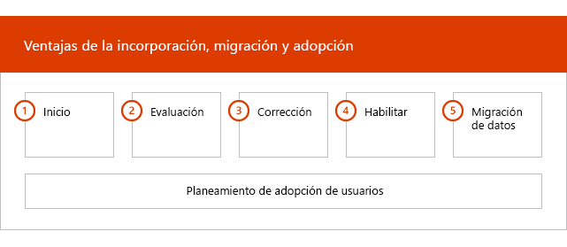
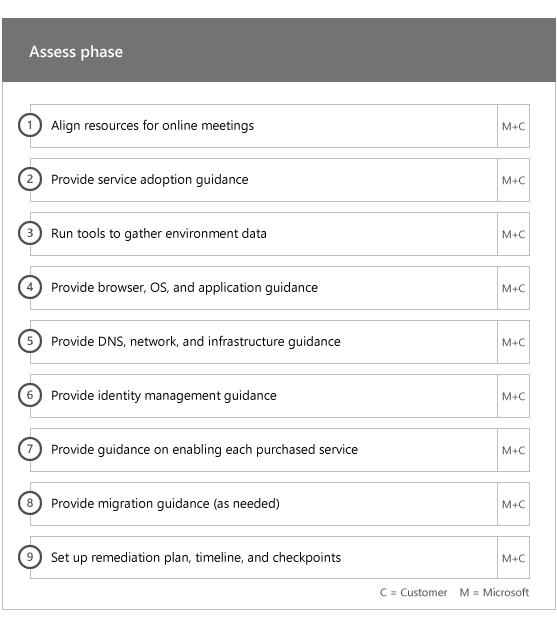
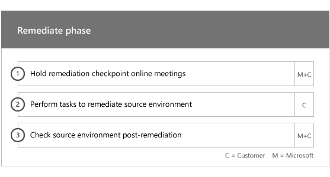
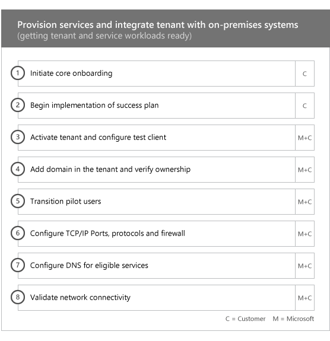
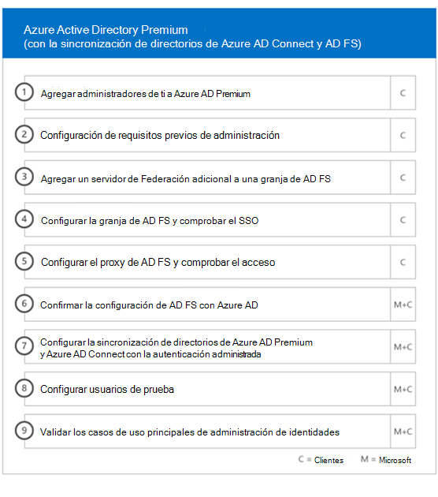
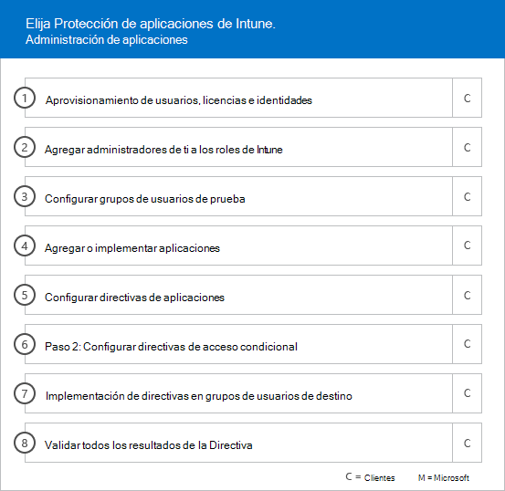
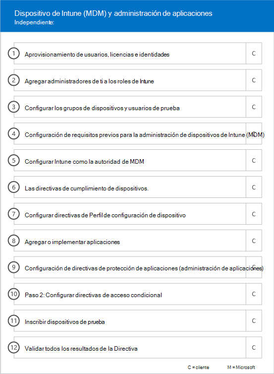

# Fases de incorporación

Al usar los [Servicios y planes pertinentes](M365-eligible-services-and-plans.md) para obtener Microsoft Azure Active Directory Premium, Microsoft Intune y Azure Information Protection listos para usarse, hay varias fases involucradas en el proceso. En las secciones siguientes se describe cada fase del proceso de incorporación.

La incorporación tiene cuatro fases principales:

## Fase de inicio

Después de adquirir el número de licencias adecuado, siga las instrucciones que se indican en el correo electrónico de confirmación de compra para asociar las licencias al espacio empresarial existente o nuevo. Luego, Microsoft comprueba que es apto para Ventajas del Centro de FastTrack e intenta ponerse en contacto con usted para ofrecer asistencia para la incorporación.

> [!NOTE]
> También puede solicitar ayuda en el [sitio de FastTrack](https://go.microsoft.com/fwlink/?linkid=780698) si está listo para implementar estos servicios en la organización.

### Solicitar asistencia

1. Inicie sesión en el [sitio de FastTrack](https://go.microsoft.com/fwlink/?linkid=780698).
2. Seleccione **Solicitar asistencia para Microsoft 365** en **acciones rápidas**, situado en la parte superior de la página de aterrizaje, o bien seleccione **Solicitar asistencia para Microsoft 365** en la tarjeta de implementación.
3. Complete el **formulario Solicitar asistencia para Microsoft 365**.

Una vez iniciado el soporte técnico de incorporación, programaremos una serie de reuniones en línea.

Los asociados de Microsoft también pueden obtener ayuda en el [sitio de FastTrack](https://go.microsoft.com/fwlink/?linkid=780698) en nombre de un cliente. Para ello:

1. Inicie sesión en el [sitio de FastTrack](https://go.microsoft.com/fwlink/?linkid=780698).
2. Haga clic en **Mis clientes**.
3. Busque el cliente o selecciónelo en la lista de clientes.
4. Haga clic en **Servicios**.
5. Complete el **formulario Solicitar asistencia para Microsoft 365**.

Una vez iniciado el soporte técnico de incorporación, FastTrack programa reuniones en línea con usted para analizar el proceso de incorporación, comprobar datos y programar una reunión de lanzamiento.

## Fase de evaluación

Una vez iniciado el proceso de incorporación, el Centro de FastTrack trabajará con usted para evaluar el entorno de origen y los requisitos. Las herramientas se ejecutan para evaluar el entorno y los especialistas de FastTrack le guiarán a través de la evaluación de su Active Directory local, los exploradores de Internet, los sistemas operativos de los dispositivos de clientes, el sistema de nombres de dominio (DNS), la red, la infraestructura y el sistema de identidad para determinar si se necesitan cambios para la incorporación.

El Centro de FastTrack también le conectará con las instrucciones sobre cómo impulsar la adopción de los servicios pertinentes.

En función de la configuración actual, ofrecemos un plan de corrección que hace que el entorno de origen cumpla los requisitos mínimos para la incorporación correcta a EMS o cada uno de sus servicios en la nube. También organizaremos llamadas al punto de control para la fase de corrección.

## Fase de corrección
Realizará las tareas del plan de corrección en el entorno de origen de modo que cumpla con los requisitos para la incorporación y adopción de cada uno de los servicios, según sea necesario.

Antes de iniciar la fase de habilitación, comprobamos conjuntamente los resultados de las actividades de corrección para garantizar que está listo para continuar.

## Fase de habilitación
Al finalizar todas las actividades de corrección, el proyecto pasa a la configuración de la infraestructura principal para el consumo de servicios y el aprovisionamiento de cada servicio en la nube de EMS pertinente.

**Fase de habilitación: capacidades principales**

La incorporación principal implica el aprovisionamiento de servicios y la integración de espacios empresariales e identidades. También incluye los pasos necesarios para proporcionar una base para la incorporación de servicios en línea como Azure AD Premium, Intune y Azure Information Protection.

> [!NOTE]
> WAP son las siglas de Proxy de aplicación web. SSL son las siglas de Capa de sockets seguros. SDS son las siglas de School Data Sync Para obtener más información sobre SDS, consulte [Le damos la bienvenida a School Data Sync de Microsoft](https://go.microsoft.com/fwlink/?linkid=871480).

> [!NOTE]
> Un método de autenticación administrado incluye, entre otras cosas, la sincronización de hash de contraseña. La integración de identidad es una actividad de una sola vez y no incluye la migración o el retiro de los métodos de autenticación existentes, como, por ejemplo, administrado o federado.

### Fase de habilitación: Azure AD Premium

El entorno de Azure AD Premium se puede configurar con la sincronización de directorios de la herramienta Azure Active Directory Connect y los Servicios de federación de Active Directory (AD FS), según sea necesario.

Para los escenarios de Azure AD Premium que incluyan la sincronización de identidades locales con la nube, le ayudaremos a agregar administradores de TI y usuarios a la suscripción, configurar los requisitos previos de administración, configurar Azure AD Premium, configurar la sincronización de directorios con autenticación administrada y AD FS con la herramienta Azure AD Connect, configurar usuarios de prueba y validar los casos de uso principales para el servicio.

La configuración de Azure AD Premium incluye habilitar las características siguientes:

-   El autoservicio de restablecimiento de contraseña (SSPR) de Azure Active Directory.

-   Azure Multi-Factor Authentication (Azure MFA).

-   Hasta tres (3) o más integraciones de aplicaciones de Software como servicio (SaaS) con el inicio de sesión único (SSO) desde [Azure Active Directory Marketplace](https://azure.microsoft.com/marketplace/active-directory/).

-   El aprovisionamiento automático de usuarios para aplicaciones SaaS previamente integradas que se muestran en la [lista de tutoriales de integración de aplicaciones](https://docs.microsoft.com/azure/active-directory/saas-apps/tutorial-list) limitada solo al aprovisionamiento saliente.

-   Pantalla de inicio de sesión personalizada, incluido el logotipo, el texto y las imágenes.

-   Grupos dinámicos y de autoservicio (grupos).

-   Azure Active Directory Application Proxy.

-   Azure Active Directory Connect Health.

-   Acceso condicional de Azure Active Directory.

-   Términos de uso de Azure Active Directory.

-   Azure Active Directory Identity Protection.

-   Azure Active Directory Privileged Identity Management.

-   Revisiones de acceso de Azure Active Directory.

-   Protección con contraseña de Azure Active Directory.

-   Azure Active Directory B2B.

### Fase de habilitación: Intune

Para Intune, le guiaremos a través de la preparación para administrar dispositivos con Microsoft Intune. Los pasos detallados dependen de su entorno de origen y se basan en su dispositivo móvil y necesidades de administración de aplicaciones móviles. Los pasos pueden incluir:

-   Conceder licencias a los usuarios finales. También proporcionamos asistencia sobre cómo se activan las licencias por volumen de su espacio empresarial de servicio en la nube de Microsoft (según sea necesario).

-   Configurar las identidades que se van a usar en Intune, al usar las identidades de la nube o Active Directory local.

-   Agregar usuarios a su suscripción de Intune, definir roles de administrador de TI y crear grupos de usuarios y dispositivos.

-   Configurar la entidad de administración de dispositivos móviles (MDM) en función de las necesidades de administración, entre las que se incluyen:

    -   Establecer Intune como entidad MDM cuando Intune es la única solución MDM.

-   Proporcionar instrucciones de MDM para:

    -   Configurar los grupos de pruebas que se usarán para validar las directivas de administración de MDM.

    -   Configurar servicios y directivas de administración de MDM como:

        -   La implementación de aplicaciones para cada plataforma compatible mediante vínculos web o vínculos profundos.

        -   Directivas de acceso condicional.

        -   La implementación del correo electrónico, las redes inalámbricas y los perfiles de la red privada virtual (VPN) si tiene una infraestructura de VPN, Wi-Fi o una entidad de certificación existente en la organización.

        -   La configuración de Microsoft Intune Exchange Connector (si es necesario).

        -   La conexión al almacenamiento de datos de Intune.

        -   La integración de Intune con:
            -   Team Viewer para asistencia remota (se requiere una suscripción a Team Viewer).

            -   Soluciones de asociados de Mobile Threat Defense (MTD) (se requiere una suscripción a Mobile Threat Defense).

            -   Solución de administración de gastos de telecomunicaciones (se requiere una suscripción a la solución de administración de gastos de telecomunicaciones).

            -   Protección contra amenazas avanzada de Microsoft Defender (se requieren licencias de Windows E5 o de Microsoft 365 E5).

    -   Inscribir dispositivos de cada [plataforma compatible](https://technet.microsoft.com/library/dn600287.aspx) en Intune.

-   Proporcionar instrucciones de protección de aplicaciones para:

    -   Configurar directivas de protección de aplicaciones para cada plataforma compatible.

    -   Configurar directivas de acceso condicional para las aplicaciones administradas.

    -   Dirigirse a los grupos de usuarios adecuados con las directivas de MAM anteriores.

    -   Usar los informes de uso de aplicaciones administradas.

-   Proporcionar instrucciones de administración de equipos para:

    -   Instalar el software cliente de Intune (cuando es necesario).

    -   Usar los informes de software y hardware disponibles en Intune.

    > [!IMPORTANT]
    > FastTrack no es compatible con la administración de equipos clásica de Windows 10 con Intune. FastTrack solo es compatible con la administración de dispositivos Windows 10 a través de la administración de dispositivos móviles (MDM) de Intune.

#### Windows Autopilot

FastTrack puede ayudarle a simplificar el aprovisionamiento de dispositivos con Intune y Windows Autopilot al otorgar nuevos dispositivos a los usuarios finales sin la necesidad de crear, mantener y aplicar imágenes personalizadas del sistema operativo en sus dispositivos.

FastTrack admite los siguientes escenarios de Autopilot:

- **Autoservicio de Azure AD:** los dispositivos se unen a Azure AD y se inscriben en Intune. Se admite este escenario cuando se usa Windows 10 1703 y versiones más recientes.

- **Autoservicio de AAD híbrido:** los dispositivos se unen tanto a AD local como a Azure AD y se inscriben en Intune. Se admite este escenario cuando se usa Windows 10 1809 y versiones más recientes.

- **Aprovisionamiento automático:** los dispositivos se unen a Azure AD automáticamente. Se admite este escenario cuando se usa Windows 1809 y versiones más recientes.

    > [!IMPORTANT]
    > FastTrack no es compatible con escenarios de Autopilot iniciados desde Configuration Manager.

Los pasos para configurar Windows Autopilot dependen del entorno de origen y pueden incluir:

- Configurar Microsoft Intune para Windows Autopilot.

- Configurar grupos dinámicos de Azure AD.

- Agregar la personalización de marca de la empresa a Azure AD.

- Crear y asignar dispositivos a perfiles de Windows Autopilot (por ejemplo, un perfil de Windows Autopilot que limite la creación de cuentas de administrador local).

- Personalizar la configuración rápida (OOBE) para cumplir los requisitos de la organización.

- Configurar la inscripción automática de MDM en Azure AD e Intune.

#### Implementar Outlook para iOS y Android de forma segura 

FastTrack puede ayudarle a implementar Outlook para iOS y Android en la organización de forma segura para asegurarse de que los usuarios tengan instaladas todas las aplicaciones necesarias.

Los pasos para implementar Outlook Mobile para iOS y Android con Intune de forma segura dependen del entorno de origen y pueden incluir:

- Descargar Outlook para iOS y Android, Microsoft Authenticator y la aplicación Portal de empresa de Intune a través de App Store de Apple o Google Play Store.
- También se proporcionan instrucciones para configurar:
    - Outlook para iOS y Android, Microsoft Authenticator y la implementación de la aplicación Portal de empresa de Intune con Intune.
    - Directivas de protección de aplicaciones
    - Directivas de acceso condicional
    - Directivas de configuración de aplicaciones

    > [!IMPORTANT]
    > El equipo de FastTrack no es compatible con la protección de Outlook para iOS y Android con directivas de buzón de correo para dispositivos móviles de Exchange.

#### Conexión a la nube

FastTrack le guiará por la preparación para conectar a la nube entornos de Configuration Manager existentes con Intune. Los pasos detallados dependen del entorno de origen. Los pasos pueden incluir:

- Explicar las ventajas de conectar Configuration Manager a la nube con Intune.

- Conceder licencias a los usuarios finales. FastTrack también proporciona asistencia sobre cómo se activan las licencias por volumen para el espacio empresarial de servicio en la nube de Microsoft (según sea necesario).

- Configurar las identidades que se van a usar en Intune, al usar las identidades de la nube y Active Directory local.

- Agregar usuarios a su suscripción de Intune, definir roles de administrador de TI y crear grupos de usuarios y dispositivos.

- Habilitar la conexión a la nube en la consola de Configuration Manager.

- Proporcionar instrucciones sobre cómo configurar la combinación híbrida de Azure Active Directory.

- Proporcionar instrucciones sobre cómo configurar Azure Active Directory para la inscripción automática de MDM.

- Proporcionar instrucciones sobre cómo configurar Cloud Management Gateway.

- Configurar cargas de trabajo compatibles que quiera cambiar a Intune.

- Instalar el cliente de Configuration Manager en dispositivos inscritos en Intune.

FastTrack también proporciona información sobre cómo impulsar la adopción correcta de los servicios pertinentes.

 

#### Fase de habilitación: Azure Information Protection

Se proporcionan a los clientes instrucciones para: 

- Activar y configurar su espacio empresarial.
- Crear y configurar etiquetas y directivas.
- Aplicar la protección de la información a documentos. 
- Clasificar y etiquetar automáticamente la información de las aplicaciones de Office (como Word, PowerPoint, Excel y Outlook), que se ejecutan en Windows y usan el cliente de Azure Information Protection.
- Usar archivos en reposo con el escáner de Azure Information Protection.
- Supervisar mensajes de correo electrónico en tránsito con reglas de flujo de correo de Exchange Online.

También se proporcionan instrucciones para los clientes que quieran aplicar la protección con Microsoft Azure Rights Management Services (Azure RMS), el cifrado de mensajes de Office 365 (OME) y la prevención de pérdida de datos (DLP).

> [!NOTE]
> **¿Quiere obtener más información?** vea [Enterprise Mobility + Security](https://www.microsoft.com/cloud-platform/enterprise-mobility).  

## Siguientes pasos

[Ventajas de FastTrack para EMS: responsabilidades de Microsoft](EMS-fasttrack-responsibilities.md)

