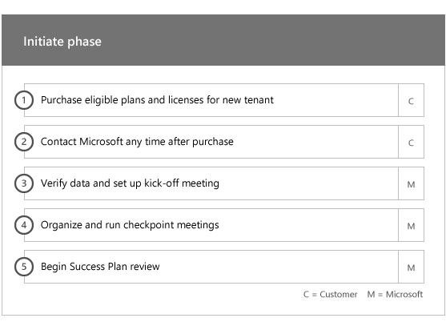

# Fases de la incorporación

Al usar los [servicios elegibles y los planes](M365-eligible-services-and-plans.md) para obtener Microsoft Azure Active Directory Premium y Microsoft Intune listos para usar, hay varias fases implicadas en el proceso. En las secciones siguientes se describe cada fase del proceso de incorporación.

La incorporación tiene cuatro fases principales:

## Fase de inicio

Después de comprar el número de licencias adecuado, siga las instrucciones del correo electrónico de confirmación de compra para asociar las licencias a su inquilino existente o nuevo inquilino. Microsoft comprueba su idoneidad para el beneficio del centro FastTrack e intenta ponerse en contacto con usted para ofrecer asistencia de incorporación.

> [!NOTE]
> También puede solicitar ayuda del [Centro FastTrack](https://go.microsoft.com/fwlink/?linkid=780698) si está listo para implementar estos servicios para su organización.

### Para solicitar asistencia

1. Inicie sesión en el [sitio de FastTrack](https://go.microsoft.com/fwlink/?linkid=780698).
2. Seleccione **FastTrack**.
3. Haga clic en **Servicios**.
4. Complete la **solicitud de asistencia con el formulario de Microsoft 365**.

Una vez iniciado el soporte técnico de incorporación, programaremos una serie de reuniones en línea.

> [!NOTE]
> Si tiene un socio de Microsoft que aparece en su inquilino de Office 365, no verá esta opción. Consulte a su partner de Microsoft para obtener ayuda.

Los socios de Microsoft también pueden obtener ayuda a través del [sitio de FastTrack](https://go.microsoft.com/fwlink/?linkid=780698) en nombre de un cliente. Para hacerlo:

1. Inicie sesión en el [sitio de FastTrack](https://go.microsoft.com/fwlink/?linkid=780698).
2. Seleccione **FastTrack**.
3. Haga clic en **Mis clientes**.
4. Busque el cliente o selecciónelo en la lista de clientes.
5. Haga clic en **Servicios**.
6. Complete la **solicitud de asistencia con el formulario de Microsoft 365**.

Una vez iniciada la compatibilidad con la incorporación, FastTrack establece una programación de reuniones en línea con usted para hablar sobre el proceso de incorporación, comprobar los datos y configurar una reunión de lanzamiento.

## Fase de evaluación

Una vez que se inicia el proceso de incorporación, el centro FastTrack trabaja con usted para evaluar el entorno de origen y los requisitos. Las herramientas se ejecutan para evaluar su entorno y los especialistas de FastTrack le guían a través de la evaluación de la implementación local de Active Directory, los exploradores de Internet, los sistemas operativos de los dispositivos de cliente, el sistema de nombres de dominio (DNS), la red, la infraestructura y el sistema de identidad para Determine si es necesario realizar cambios para la incorporación.

El centro FastTrack también le conecta con instrucciones sobre cómo impulsar la adopción satisfactoria de los servicios pertinentes.

En función de la configuración actual, ofrecemos un plan de corrección que pone el entorno de origen en los requisitos mínimos para la incorporación correcta a EMS o sus servicios en la nube individuales. También se configuran las llamadas de punto de comprobación adecuadas para la fase de corrección.

## Fase de corrección
Se realizan las tareas del plan de corrección en el entorno de origen para que se cumplan los requisitos para la incorporación y la adopción de cada servicio (según sea necesario).

Antes de iniciar la fase de habilitación, comprobamos conjuntamente los resultados de las actividades de corrección para garantizar que está listo para continuar.

## Fase de habilitación
Una vez completadas todas las actividades de corrección, el proyecto se desplazará a la configuración de la infraestructura básica para el consumo de servicios y el aprovisionamiento de cada servicio de nube de EMS elegible.

**Habilitar capacidades de fase principal**

La incorporación principal implica el aprovisionamiento de servicios y la integración de inquilinos e identidades. También incluye los pasos para ofrecer una base para los servicios en línea de incorporación, como Azure AD Premium y Intune.

> [!NOTE]
> WAP son las siglas de Proxy de aplicación web. SSL son las siglas de Capa de sockets seguros. SDS son las siglas de School Data Sync Para obtener más información sobre SDS, consulte [Le damos la bienvenida a School Data Sync de Microsoft](https://go.microsoft.com/fwlink/?linkid=871480).

> [!NOTE]
> Un método de autenticación administrada incluye, pero no se limita a la sincronización de hash de contraseña. La integración de identidades es una actividad de una sola vez y no incluye la migración o el retiro de los métodos de autenticación existentes, como administrados o federados.

### Fase de habilitación: Azure AD Premium

El entorno de Azure AD Premium se puede configurar mediante la sincronización de directorios de la herramienta Azure Active Directory Connect y los servicios de Federación de Active Directory (AD FS) (según sea necesario).

Para los escenarios de Azure AD Premium que incluyan la sincronización de identidades locales con la nube, le ayudamos a agregar administradores y usuarios de ti a su suscripción, configurar los requisitos previos de administración, configurar Azure AD Premium, configurar el directorio sincronización con autenticación administrada y AD FS mediante la herramienta de Azure AD Connect, configuración de usuarios de prueba y validación de los casos de uso principales para el servicio.

La configuración de Azure AD Premium incluye la habilitación de las siguientes características:

-   Restablecimiento de contraseña de autoServicio de Azure Active Directory (SSPR).

-   Azure multi-factor Authentication (Azure MFA).

-   Hasta tres (3) o más integraciones de aplicación de software como servicio (SaaS) con inicio de sesión único (SSO) desde [Azure Active Directory Marketplace](https://azure.microsoft.com/marketplace/active-directory/).

-   Aprovisionamiento automático de usuarios para aplicaciones SaaS preintegradas, como se muestra en la [lista de tutorial de integración de aplicaciones](https://docs.microsoft.com/en-us/azure/active-directory/saas-apps/tutorial-list), limitada solo al aprovisionamiento saliente.

-   Pantalla de inicio de sesión personalizada, que incluye logotipos, texto e imágenes.

-   Grupos dinámicos y de autoServicio (grupos).

-   Proxy de aplicación de Azure Active Directory.

-   Estado de Azure Active Directory Connect.

-   Acceso condicional de Azure Active Directory.

-   Condiciones de uso de Azure Active Directory.

-   Protección de identidad de Azure Active Directory.

-   Administración de identidades privilegiada de Azure Active Directory.

-   Revisiones de acceso de Azure Active Directory.

### Fase de habilitación: Intune

Para Intune, le guiarán por la preparación para usar Microsoft Intune para administrar dispositivos. Los pasos exactos dependen de su entorno de origen y se basan en sus necesidades de administración de aplicaciones móviles y dispositivos móviles. Los pasos pueden incluir:

-   Conceder licencias a los usuarios finales. También ofrecemos asistencia sobre cómo activar licencias por volumen para el inquilino del servicio de nube de Microsoft (según sea necesario).

-   Configurar las identidades que se usarán en Intune aprovechando las identidades locales de Active Directory o de la nube.

-   Adición de usuarios a su suscripción de Intune, definición de roles de administrador de ti y creación de grupos de dispositivos y usuarios.

-   Configurar la autoridad de administración de dispositivos móviles (MDM), en función de las necesidades de administración, entre las que se incluyen:

    -   La configuración de Intune como su autoridad de MDM cuando Intune es la única solución de MDM o está junto con la administración de dispositivos móviles para Office 365.

-   Proporciona instrucciones de MDM para:

    -   Configurar los grupos de pruebas que se usarán para validar las directivas de administración de MDM.

    -   Configuración de servicios y directivas de administración de MDM como:

        -   Implementación de aplicaciones para cada plataforma admitida a través de vínculos Web o vínculos profundos.

        -   Directivas de acceso condicional.

        -   Implementación de correo electrónico, redes inalámbricas y perfiles de red privada virtual (VPN) si tiene una entidad de certificación, una infraestructura de Wi-Fi o VPN existente en su organización.

        -   Configuración del conector de Exchange de Microsoft Intune (si es aplicable).

        -   Conexión a un almacén de datos de Intune

        -   Integración de Intune con:
            -   Team Viewer para asistencia remota (se requiere la suscripción a Team Viewer).

            -   Soluciones de socios de Mobile Threat Defense (MTD) (se requiere subcription de defensa de amenazas móviles).

            -   Solución de administración de gastos de telecomunicaciones (se requiere una suscripción a la solución de administración de gastos de telecomunicaciones).

            -   Protección contra amenazas avanzada de Windows Defender (se necesitan licencias de Windows E5 o Microsoft 365 E5).

    -   Inscripción de dispositivos de cada [plataforma admitida](https://technet.microsoft.com/library/dn600287.aspx) en Intune.

-   Proporciona instrucciones de protección de aplicaciones en:

    -   Configuración de directivas de protección de aplicaciones para cada plataforma compatible.

    -   Configuración de directivas de acceso condicional para aplicaciones administradas.

    -   Dirigirse a los grupos de usuarios apropiados con las directivas de MAM anteriores.

    -   Uso de informes de uso de aplicaciones administradas.

-   Proporciona instrucciones para la administración de equipos en:

    -   Instalación del software cliente de Intune (cuando sea necesario).

    -   Uso de los informes de software y hardware disponibles en Intune.

    > [!IMPORTANT]
    > FastTrack no es compatible con la administración de equipos Windows 10 Classic con Intune. FastTrack solo admite la administración de dispositivos de Windows 10 a través de Intune administración de dispositivos móviles (MDM).

#### Windows Autopilot

FastTrack puede ayudarle a simplificar el aprovisionamiento de dispositivos con Windows AutoPilot e Intune proporcionando nuevos dispositivos a los usuarios finales sin la necesidad de crear, mantener y aplicar imágenes personalizadas del sistema operativo a los dispositivos.

FastTrack admite los siguientes escenarios de AutoPilot:

- **Autoservicio de Azure ad:** Los dispositivos se unen a Azure AD y se inscriben en Intune. Este escenario es compatible con Windows 10 1703 y las versiones más recientes.

- **Autoservicio de AAD híbrido:** Los dispositivos se unen a AD local y a Azure AD y se inscriben en Intune. Este escenario es compatible con Windows 10 1809 y las versiones más recientes.

- **Aprovisionamiento automático:** Los dispositivos se unen a Azure AD automáticamente. Este escenario es compatible con Windows 1809 y las versiones más recientes.

    > [!IMPORTANT]
    > FastTrack no admite escenarios de AutoPilot iniciados desde el administrador de configuración.

Los pasos para configurar el piloto automático de Windows dependen de su entorno de origen y pueden incluir:

- Configurar y configurar Microsoft Intune para Windows AutoPilot.

- Configurar grupos dinámicos de Azure AD

- Agregue la personalización de marca de su empresa a Azure AD.

- Cree y asigne dispositivos a perfiles de Windows AutoPilot (por ejemplo, un perfil de Windows AutoPilot que restringe la creación de cuentas de administrador local).

- Personalizar la experiencia rápida (OOBE) para cumplir con los requisitos de la organización.

- Configurar la inscripción automática de MDM en Azure AD e Intune.

#### Implementación segura de Outlook para iOS y Android

FastTrack puede ayudarle a implementar Outlook para iOS y Android de forma segura en su organización para asegurarse de que los usuarios tengan instaladas todas las aplicaciones necesarias.

Los pasos para implementar de forma segura Outlook Mobile para iOS y Android con Intune dependen de su entorno de origen y pueden incluir:

- Descargue Outlook para iOS y Android, Microsoft Authenticator y la aplicación del portal de empresa de Intune a través de la App Store de Apple o Google Play Store.
- También se proporcionan instrucciones para configurar:
    - Outlook para iOS y Android, Microsoft Authenticator y la implementación de la aplicación del portal de empresa de Intune con Intune.
    - Directivas de protección de aplicaciones
    - Directivas de acceso condicional
    - Directivas de configuración de la aplicación

    > [!IMPORTANT]
    > El equipo de FastTrack no es compatible con la protección de Outlook para iOS y Android con las directivas de buzón de correo de dispositivo móvil de Exchange.

#### Co-administración

FastTrack le guía a través de la preparación para administrar simultáneamente dispositivos Windows 10 con Configuration Manager e Intune. Los pasos exactos dependen de su entorno de origen y pueden incluir:

- Explique las ventajas de la co-administración.

- Conceder licencias a los usuarios finales. FastTrack también proporciona ayuda sobre cómo activar licencias por volumen para el inquilino de servicio de nube de Microsoft (según sea necesario).

- Configure las identidades que se usarán en Intune aprovechando las identidades de nube o de Active Directory local.

- Adición de usuarios a su suscripción de Intune, definición de roles de administrador de ti y creación de grupos de dispositivos y usuarios.

- Proporcionar instrucciones sobre cómo pasar de Intune integrado con System Center Configuration Manager (híbrido) a Intune Standalone.

- Proporcionar instrucciones sobre la configuración de Azure Active Directory para la inscripción automática de MDM.

- Proporcionar instrucciones para la configuración de una Unión híbrida de Azure Active Directory.

- Proporcionar instrucciones sobre cómo configurar la puerta de enlace de administración en la nube

- Habilite la co-administración en la consola de Configuration Manager.

- Configure las cargas de trabajo compatibles que quiera cambiar a Intune.

- Instale el cliente de Configuration Manager en dispositivos inscritos de Intune.

- Proporcionar instrucciones sobre cómo supervisar la actividad de co-administración en el entorno.

FastTrack también proporciona orientación sobre cómo impulsar la adopción satisfactoria de los servicios elegibles.

> [!NOTE]
> **¿Desea obtener más información?** consulte [Enterprise Mobility + Security](https://www.microsoft.com/en-us/cloud-platform/enterprise-mobility).

## Pasos siguientes

[Ventajas de FastTrack para EMS-responsabilidades de Microsoft](EMS-fasttrack-responsibilities.md)
