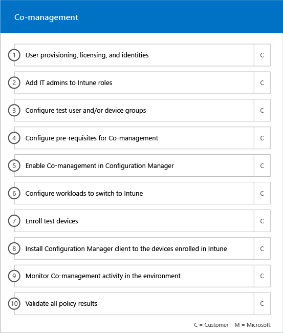

# Fases de incorporaciónOnboarding Phases

Al usar los [Servicios y planes pertinentes](M365-eligible-services-and-plans.md) para obtener Microsoft Azure Active Directory Premium, Microsoft Intune y Azure Information Protection listos para usarse, hay varias fases involucradas en el proceso.When you use the [Eligible Services and Plans](M365-eligible-services-and-plans.md) to get Microsoft Azure Active Directory Premium, Microsoft Intune, and Azure Information Protection ready for use, there are several phases involved in the process. En las secciones siguientes se describe cada fase del proceso de incorporación.The following sections describe each phase of the onboarding process.

La incorporación tiene cuatro fases principales:Onboarding has four primary phases:

## Fase de inicioInitiate phase

Después de adquirir el número de licencias adecuado, siga las instrucciones que se indican en el correo electrónico de confirmación de compra para asociar las licencias al espacio empresarial existente o nuevo.After you purchase the appropriate number and types of licenses, follow the guidance from the purchase confirmation email to associate the licenses to your existing or new tenant. Luego, Microsoft comprueba que es apto para Ventajas del Centro de FastTrack e intenta ponerse en contacto con usted para ofrecer asistencia para la incorporación.Microsoft then verifies your eligibility for the FastTrack Center Benefit and tries to contact you to offer onboarding assistance.

> [!NOTE]
> Si está listo para implementar estos servicios en la organización, también puede solicitar ayuda al [Centro de FastTrack](https://go.microsoft.com/fwlink/?linkid=780698). You can also request assistance from the [FastTrack Center](https://go.microsoft.com/fwlink/?linkid=780698) if you're ready to deploy these services for your organization.

### Solicitar asistenciaTo request assistance

1. Inicie sesión en el [sitio de FastTrack](https://go.microsoft.com/fwlink/?linkid=780698).Sign in to the [FastTrack site](https://go.microsoft.com/fwlink/?linkid=780698).
2. Seleccione **FastTrack**.Select **FastTrack**.
3. Haga clic en **Servicios**.Select **Services**.
4. Complete el **Formulario de solicitud de asistencia para Microsoft 365**.Complete the **Request for Assistance with Microsoft 365** form.

Una vez iniciado el soporte técnico de incorporación, programaremos una serie de reuniones en línea.Once onboarding assistance starts, we set up a schedule of online meetings.

> [!NOTE]
> Si tiene un asociado de Microsoft en su espacio empresarial de Office 365, no verá esta opción.If you have a partner listed in your Office 365 tenant, you won't see this option. Consulte a su asociado de Microsoft para obtener asistencia.Please consult your partner for assistance.

Los asociados de Microsoft también pueden obtener ayuda en el [sitio de FastTrack](https://go.microsoft.com/fwlink/?linkid=780698) en nombre de un cliente.Partners can also get help through the [FastTrack site](https://go.microsoft.com/fwlink/?linkid=780698) on behalf of a customer. Para ello:To do so:

1. Inicie sesión en el [sitio de FastTrack](https://go.microsoft.com/fwlink/?linkid=780698).Sign in to the [FastTrack site](https://go.microsoft.com/fwlink/?linkid=780698).
2. Seleccione **FastTrack**.Select **FastTrack**.
3. Haga clic en **Mis clientes**.Select **My Customers**.
4. Busque el cliente o selecciónelo en la lista de clientes.Search for your customer or select them from your customer list.
5. Haga clic en **Servicios**.Select **Services**.
6. Complete el **Formulario de solicitud de asistencia para Microsoft 365**.Complete the **Request for Assistance with Microsoft 365** form.

Una vez iniciado el soporte técnico de incorporación, FastTrack programa reuniones en línea con usted para analizar el proceso de incorporación, comprobar datos y programar una reunión de lanzamiento.Once the onboarding support starts, FastTrack sets up a schedule of online meetings with you to discuss the onboarding process, verify data, and set up a kick-off meeting.

## Fase de evaluaciónAssess phase

Una vez iniciado el proceso de incorporación, el Centro de FastTrack trabajará con usted para evaluar el entorno de origen y los requisitos.Once the onboarding process begins, the FastTrack Center works with you to assess your source environment and the requirements. Las herramientas se ejecutan para evaluar el entorno y los especialistas de FastTrack le guiarán a través de la evaluación de su Active Directory local, los exploradores de Internet, los sistemas operativos de los dispositivos de clientes, el sistema de nombres de dominio (DNS), la red, la infraestructura y el sistema de identidad para determinar si se necesitan cambios para la incorporación.Tools are run to assess your environment, and FastTrack Specialists guide you through assessing your on-premises Active Directory, Internet browsers, client devices' operating systems, Domain Name System (DNS), network, infrastructure, and identity system to determine if any changes are required for onboarding.

El Centro de FastTrack también le conectará con las instrucciones sobre cómo impulsar la adopción de los servicios pertinentes.The FastTrack Center also connects you with guidance about how to drive successful adoption of the eligible services.

En función de la configuración actual, ofrecemos un plan de corrección que hace que el entorno de origen cumpla los requisitos mínimos para la incorporación correcta a EMS o cada uno de sus servicios en la nube.Based on your current setup, we provide a remediation plan that brings your source environment up to the minimum requirements for successful onboarding to O365_W14_2nd and, if needed, for successful mailbox and/or data migration. También organizaremos llamadas al punto de control para la fase de corrección.We also set up appropriate checkpoint calls for the Remediate phase.

## Fase de correcciónRemediate phase
Realizará las tareas del plan de corrección en el entorno de origen de modo que cumpla con los requisitos para la incorporación y adopción de cada uno de los servicios, según sea necesario.You perform the tasks in the remediation plan on your source environment so that you meet the requirements for onboarding and adopting each service (as needed).

Antes de iniciar la fase de habilitación, comprobamos conjuntamente los resultados de las actividades de corrección para garantizar que está listo para continuar.Before beginning the Enable phase, we jointly verify the outcomes of the remediation activities to make sure you’re ready to proceed.

## Fase de habilitaciónEnable phase
Al finalizar todas las actividades de corrección, el proyecto pasa a la configuración de la infraestructura principal para el consumo de servicios y el aprovisionamiento de cada servicio en la nube de EMS pertinente.When all remediation activities are complete, the focus shifts to configuring the core infrastructure for service consumption, provisioning O365_W14_2nd, and conducting the activities to drive service adoption.

**Fase de habilitación: capacidades principales****Enable phase - Core capabilities**

La incorporación principal implica el aprovisionamiento de servicios y la integración de espacios empresariales e identidades.Core onboarding involves service provisioning and tenant and identity integration. También incluye los pasos necesarios para proporcionar una base para la incorporación de servicios en línea como Azure AD Premium, Intune y Azure Information Protection.It also includes steps for providing a foundation for onboarding online services like Azure AD Premium, Intune, and Azure Information Protection.

> [!NOTE]
> WAP son las siglas de Proxy de aplicación web. SSL son las siglas de Capa de sockets seguros. SDS son las siglas de School Data Sync Para obtener más información sobre SDS, consulte [Le damos la bienvenida a School Data Sync de Microsoft](https://go.microsoft.com/fwlink/?linkid=871480).WAP stands for Web Application Proxy. SSL stands for Secure Sockets Layer. SDS stands for School Data Sync. For more information on SDS, see [Welcome to Microsoft School Data Sync](https://go.microsoft.com/fwlink/?linkid=871480).

> [!NOTE]
> Un método de autenticación administrado incluye, entre otras cosas, la sincronización de hash de contraseña.A managed authentication method includes, but is not limited to password hash synchronization. La integración de identidad es una actividad de una sola vez y no incluye la migración o el retiro de los métodos de autenticación existentes, como, por ejemplo, administrado o federado.Identity integration is a one time activity and does not include migrating or decommissioning of existing authentication methods, such as managed or federated.

### Fase de habilitación: Azure AD PremiumEnable phase - Azure AD Premium

El entorno de Azure AD Premium se puede configurar con la sincronización de directorios de la herramienta Azure Active Directory Connect y los Servicios de federación de Active Directory (AD FS), según sea necesario.The Azure AD Premium environment can be set up by using the Azure Active Directory Connect tool directory synchronization and Active Directory Federation Services (AD FS) (as needed).

Para los escenarios de Azure AD Premium que incluyan la sincronización de identidades locales con la nube, le ayudaremos a agregar administradores de TI y usuarios a la suscripción, configurar los requisitos previos de administración, configurar Azure AD Premium, configurar la sincronización de directorios con autenticación administrada y AD FS con la herramienta Azure AD Connect, configurar usuarios de prueba y validar los casos de uso principales para el servicio.For Azure AD Premium scenarios that include synchronizing on-premises identities to the cloud, we help you by adding IT admins and users to your subscription, configuring management prerequisites, setting up Azure AD Premium, setting up directory synchronization with managed authentication and AD FS using the Azure AD Connect tool, configuring test users, and validating your core use cases for the service.

La configuración de Azure AD Premium incluye habilitar las características siguientes:Azure AD Premium setup includes enabling the following features:

-   El autoservicio de restablecimiento de contraseña (SSPR) de Azure Active Directory.Azure Active Directory Self-Service Password Reset (SSPR).

-   Azure Multi-Factor Authentication (Azure MFA).Azure Multi-Factor Authentication (Azure MFA).

-   Hasta tres (3) o más integraciones de aplicaciones de Software como servicio (SaaS) con el inicio de sesión único (SSO) desde [Azure Active Directory Marketplace](https://azure.microsoft.com/marketplace/active-directory/).Up to three (3) or more Software as a Service (SaaS) application integrations with Single Sign-On (SSO) from the [Azure Active Directory Marketplace](https://azure.microsoft.com/marketplace/active-directory/).

-   El aprovisionamiento automático de usuarios para aplicaciones SaaS previamente integradas que se muestran en la [lista de tutoriales de integración de aplicaciones](https://docs.microsoft.com/es-ES/azure/active-directory/saas-apps/tutorial-list) limitada solo al aprovisionamiento saliente.Automatic user provisioning for pre-integrated SaaS applications as listed in the [App integration tutorial list](https://docs.microsoft.com/en-us/azure/active-directory/saas-apps/tutorial-list), limited to outbound provisioning only.

-   Pantalla de inicio de sesión personalizada, incluido el logotipo, el texto y las imágenes.Customized logon screen, including logo, text, and images.

-   Grupos dinámicos y de autoservicio (grupos).Self-Service and Dynamic Groups (Groups).

-   Azure Active Directory Application Proxy.Azure Active Directory Application Proxy.

-   Azure Active Directory Connect Health.Azure Active Directory Connect

-   Acceso condicional de Azure Active Directory.Azure Active Directory Conditional Access

-   Términos de uso de Azure Active Directory.Azure Active Directory Terms of Use.

-   Azure Active Directory Identity Protection.Azure Active Directory Identity Protection

-   Azure Active Directory Privileged Identity Management.Azure Active Directory Privileged Identity Management.

-   Revisiones de acceso de Azure Active Directory.Azure Active Directory Conditional Access

### Fase de habilitación: IntuneEnable phase - Intune

Para Intune, le guiaremos a través de la preparación para administrar dispositivos con Microsoft Intune.For Intune, we guide you through getting ready to use Microsoft Intune to manage devices. Los pasos detallados dependen de su entorno de origen y se basan en su dispositivo móvil y necesidades de administración de aplicaciones móviles.The exact steps depend on your source environment and are based on your mobile device and mobile app management needs. Los pasos pueden incluir:The steps include:

-   Conceder licencias a los usuarios finales.Licensing your end users. También proporcionamos asistencia sobre cómo se activan las licencias por volumen de su espacio empresarial de servicio en la nube de Microsoft (según sea necesario).We also provide assistance on how to activate volume licenses for your Microsoft cloud service tenant (as needed).

-   Configurar las identidades que se van a usar en Intune, al usar las identidades de la nube o Active Directory local.Configuring identities to be used by Intune by leveraging either your on-premises Active Directory or cloud identities.

-   Agregar usuarios a su suscripción de Intune, definir roles de administrador de TI y crear grupos de usuarios y dispositivos.Adding users to your Intune subscription, defining IT admin roles, and creating user and device groups.

-   Configurar la entidad de la administración de dispositivos móviles (MDM), en función de las necesidades de administración, entre las que se incluyen:Configuring your Mobile Device Management (MDM) authority, based on your management needs, including:

    -   Configurar Intune como entidad MDM cuando Intune es la única solución MDM o en conjunto con la Administración de dispositivos móviles para Office 365.Setting Intune as your MDM authority when Intune is your only MDM solution or is in conjunction with Mobile Device Management for Office 365.

-   Proporcionar instrucciones de MDM para:Providing MDM guidance for:

    -   Configurar los grupos de pruebas que se usarán para validar las directivas de administración de MDM.Configuring tests groups to be used to validate MDM management policies.

    -   Configurar servicios y directivas de administración de MDM como:Configuring MDM management policies and services like:

        -   La implementación de aplicaciones para cada plataforma compatible mediante vínculos web o vínculos profundos.Application deployment for each supported platform through web links or deep links.

        -   Directivas de acceso condicional.Conditional access device policies

        -   La implementación del correo electrónico, las redes inalámbricas y los perfiles de la red privada virtual (VPN) si tiene una infraestructura de VPN, Wi-Fi o una entidad de certificación existente en la organización.Deployment of email, wireless networks, and virtual private network (VPN) profiles if you have an existing  certificate authority, Wi-Fi or VPN infrastructure in your organization.

        -   La configuración de Microsoft Intune Exchange Connector (si es necesario).Setting up the Microsoft Intune Exchange Connector (when applicable).

        -   La conexión al almacenamiento de datos de Intune.Connecting to Intune Data Warehouse

        -   La integración de Intune con:Integrating Intune with:
            -   Team Viewer para asistencia remota (se requiere una suscripción a Team Viewer).Team Viewer for remote assistance (Team viewer subscription is required).

            -   Soluciones de asociados de Mobile Threat Defense (MTD) (se requiere una suscripción a Mobile Threat Defense).Mobile Threat Defense (MTD) partner solutions (Mobile Threat Defense subcription is required).

            -   Solución de administración de gastos de telecomunicaciones (se requiere una suscripción a la solución de administración de gastos de telecomunicaciones).Telecom expense management solution (Telecom expense management solution subscription is required).

            -   Protección contra amenazas avanzada de Windows Defender (se requieren licencias de Windows E5 o de Microsoft 365 E5).Windows Defender Advanced Threat Protection (Windows E5 or Microsoft 365 E5 licenses are required).

    -   Inscribir dispositivos de cada [plataforma compatible](https://technet.microsoft.com/library/dn600287.aspx) en Intune.Enrolling devices of each [supported platform](https://technet.microsoft.com/library/dn600287.aspx) to Intune.

-   Proporcionar instrucciones de protección de aplicaciones para:Providing App Protection guidance on:

    -   Configurar directivas de protección de aplicaciones para cada plataforma compatible.Configuring app protection policies for each supported platform.

    -   Configurar directivas de acceso condicional para las aplicaciones administradas.Configuring conditional access policies for managed apps.

    -   Dirigirse a los grupos de usuarios adecuados con las directivas de MAM anteriores.Targeting the appropriate user groups with the above MAM policies.

    -   Usar los informes de uso de aplicaciones administradas.Using managed-applications usage reports.

-   Proporcionar instrucciones de administración de equipos para:Providing PC management guidance on:

    -   Instalar el software cliente de Intune (cuando es necesario).Installing the Intune client software (when needed).

    -   Usar los informes de software y hardware disponibles en Intune.Using the software and hardware reports available in Intune.

    > [!IMPORTANT]
    > FastTrack no es compatible con la administración de equipos clásica de Windows 10 con Intune.FastTrack does not support Windows 10 classic PC management with Intune. FastTrack solo es compatible con la administración de dispositivos Windows 10 a través de la administración de dispositivos móviles (MDM) de Intune.FastTrack only supports Windows 10 device management through Intune mobile device management (MDM).

#### Windows AutopilotWindows Autopilot

FastTrack puede ayudarle a simplificar el aprovisionamiento de dispositivos con Intune y Windows Autopilot al otorgar nuevos dispositivos a los usuarios finales sin la necesidad de crear, mantener y aplicar imágenes personalizadas del sistema operativo en sus dispositivos.FastTrack can help you through simplifying your device provisioning with Windows Autopilot and Intune by giving new devices to your end users without the need to build, maintain and apply custom operating system images to your devices.

FastTrack admite los siguientes escenarios de Autopilot:FastTrack supports the following Autopilot scenarios:

- **Autoservicio de Azure AD:** los dispositivos se unen a Azure AD y se inscriben en Intune.**Azure AD self-service:** Devices join Azure AD and enroll into Intune. Se admite este escenario cuando se usa Windows 10 1703 y versiones más recientes.This scenario is supported when using Windows 10 1703 and latest versions.

- **Autoservicio de AAD híbrido:** los dispositivos se unen tanto a AD local como a Azure AD y se inscriben en Intune.**Hybrid AAD self-service:** Devices join both on-premises AD and Azure AD and enroll into Intune. Se admite este escenario cuando se usa Windows 10 1809 y versiones más recientes.This scenario is supported when using Windows 10 1809 and latest versions.

- **Aprovisionamiento automático:** los dispositivos se unen a Azure AD automáticamente.**Self-provisioning:** Devices automatically join Azure AD. Se admite este escenario cuando se usa Windows 1809 y versiones más recientes.This scenario is supported when using Windows 1809 and latest versions.

    > [!IMPORTANT]
    > FastTrack no es compatible con escenarios de Autopilot iniciados desde Configuration Manager.FastTrack does not support Autopilot scenarios initiated from Configuration Manager.

Los pasos para configurar Windows Autopilot dependen del entorno de origen y pueden incluir:The steps to setup Windows Autopilot depends on your source environment and it can include:

- Configurar Microsoft Intune para Windows Autopilot.Configure and setup Microsoft Intune for Windows Autopilot.

- Configurar grupos dinámicos de Azure AD.Configure Azure AD dynamic groups

- Agregar la personalización de marca de la empresa a Azure AD.Add your Company branding into Azure AD.

- Crear y asignar dispositivos a perfiles de Windows Autopilot (por ejemplo, un perfil de Windows Autopilot que limite la creación de cuentas de administrador local).Create and assign devices to Windows Autopilot profiles (e.g a Windows Autopilot profile that restricts Local Administrator account creation).

- Personalizar la configuración rápida (OOBE) para cumplir los requisitos de la organización.Customize the Out-of-box-experience (OOBE) to comply with organization's requirements.

- Configurar la inscripción automática de MDM en Azure AD e Intune.Configuring MDM Auto-enrollment in Azure AD and Intune.

#### Implementar Outlook para iOS y Android de forma segura Outlook for iOS and Android

FastTrack puede ayudarle a implementar Outlook para iOS y Android en la organización de forma segura para asegurarse de que los usuarios tengan instaladas todas las aplicaciones necesarias.FastTrack can help you by deploying Outlook for iOS and Android securely in your organization to ensure your users have all the required apps installed.

Los pasos para implementar Outlook Mobile para iOS y Android con Intune de forma segura dependen del entorno de origen y pueden incluir:The steps to securely deploy Outlook Mobile for iOS and Android with Intune depends on your source environment and it can include:

- Descargar Outlook para iOS y Android, Microsoft Authenticator y la aplicación Portal de empresa de Intune a través de App Store de Apple o Google Play Store.Download Outlook for iOS and Android, Microsoft Authenticator and the Intune Company portal app via the Apple App Store or Google Play Store.
- También se proporcionan instrucciones para configurar:Also provide guidance on setting up:
    - Outlook para iOS y Android, Microsoft Authenticator y la implementación de la aplicación Portal de empresa de Intune con Intune.Outlook for iOS and Android, Microsoft Authenticator and the Intune Company portal app deployment with Intune.
    - Directivas de protección de aplicacionesApp protection policies
    - Directivas de acceso condicionalConditional access device policies
    - Directivas de configuración de aplicacionesApp configuration policies

    > [!IMPORTANT]
    > El equipo de FastTrack no es compatible con la protección de Outlook para iOS y Android con directivas de buzón de correo para dispositivos móviles de Exchange.FastTrack team does not support securing Outlook for iOS and Android with Exchange mobile device mailbox policies.

#### Administración conjuntaCo-management

FastTrack le guiará a través de la preparación para administrar simultáneamente dispositivos con Windows 10 con Configuration Manager e Intune.FastTrack guides you through getting ready to concurrently manage Windows 10 devices with both Configuration Manager and Intune. Los pasos detallados dependen del entorno de origen y pueden incluir:The exact steps depend on your source environment, and it can include:

- Explicar las ventajas de la administración conjunta.Explain the benefits of Co-management.

- Conceder licencias a los usuarios finales.License your end users. FastTrack también proporciona asistencia sobre cómo se activan las licencias por volumen para el espacio empresarial de servicio en la nube de Microsoft (según sea necesario).FastTrack also provides assistance on how to activate volume licenses for your Microsoft cloud service tenant (as needed).

- Configurar las identidades que se usarán en Intune al usar las identidades de la nube o Active Directory local.Configure identities to be used by Intune by leveraging either your on-premises Active Directory and/or cloud identities.

- Agregar usuarios a su suscripción de Intune, definir roles de administrador de TI y crear grupos de usuarios y dispositivos.Adding users to your Intune subscription, defining IT admin roles, and creating user and device groups.

- Proporcionar instrucciones sobre cómo moverse de Intune integrado con System Center Configuration Manager (híbrido) a la versión independiente de Intune.Provide guidance on how to move from Intune integrated with System Center Configuration Manager (Hybrid) to Intune Standalone.

- Proporcionar instrucciones sobre cómo configurar Azure Active Directory para la inscripción automática de MDM.Provide guidance on setting up Azure Active Directory for MDM auto-enrollment.

- Proporcionar instrucciones sobre cómo configurar la combinación híbrida de Azure Active Directory.Provide guidance setting up hybrid Azure Active Directory Join.

- Proporcionar instrucciones sobre cómo configurar Cloud Management Gateway.Provide guidance on how to set up Cloud Management Gateway

- Habilitar la administración conjunta en la consola de Configuration Manager.Enable Co-management in Configuration Manager console.

- Configurar cargas de trabajo compatibles que quiera cambiar a Intune.Configure supported workloads that you want to switch to Intune.

- Instalar el cliente de Configuration Manager en dispositivos inscritos en Intune.Install Configuration Manager client in Intune enrolled devices.

- Proporcionar instrucciones sobre cómo se supervisa la actividad de administración conjunta de su entorno.Provide guidance on how to monitor the Co-management activity in your environment.

FastTrack también proporciona información sobre cómo impulsar la adopción correcta de los servicios pertinentes.FastTrack also provides you guidance on how to drive successful adoption of the eligible services.

#### Fase de habilitación: Azure Information ProtectionEnable phase – Azure Information Protection

Se proporcionan a los clientes instrucciones para:Customers are provided guidance on how to: 

- Activar y configurar su espacio empresarial.Activate and configure their tenant.
- Crear y configurar etiquetas y directivas.Create and set up labels and policies.
- Aplicar la protección de la información a documentos.Apply information protection to documents. 
- Clasificar y etiquetar automáticamente la información de las aplicaciones de Office (como Word, PowerPoint, Excel y Outlook), que se ejecutan en Windows y usan el cliente de Azure Information Protection.Automatically classify and label information in Office apps (like Word, PowerPoint, Excel, and Outlook) running on Windows and using the Azure Information Protection client.
- Usar archivos en reposo con el escáner de Azure Information Protection.Use files at rest using the Azure Information Protection scanner.
- Supervisar mensajes de correo electrónico en tránsito con reglas de flujo de correo de Exchange Online.Monitor emails in transit using Exchange Online mail flow rules.

También se proporcionan instrucciones para los clientes que quieran aplicar la protección con Microsoft Azure Rights Management Services (Azure RMS), el cifrado de mensajes de Office 365 (OME) y la prevención de pérdida de datos (DLP).Guidance is also provided to customers who want to apply protection using Microsoft Azure Rights Management Services (Azure RMS), Office 365 Message Encryption (OME), and data loss prevention (DLP).

> [!NOTE]
> **¿Quiere obtener más información?** vea [Enterprise Mobility + Security](https://www.microsoft.com/en-us/cloud-platform/enterprise-mobility).  **Want to learn more?** see [Enterprise Mobility + Security](https://www.microsoft.com/en-us/cloud-platform/enterprise-mobility).

## Siguientes pasosNext steps

[Ventajas de FastTrack para EMS: responsabilidades de MicrosoftFastTrack benefit for EMS - Microsoft responsibilities](EMS-fasttrack-responsibilities.md)
