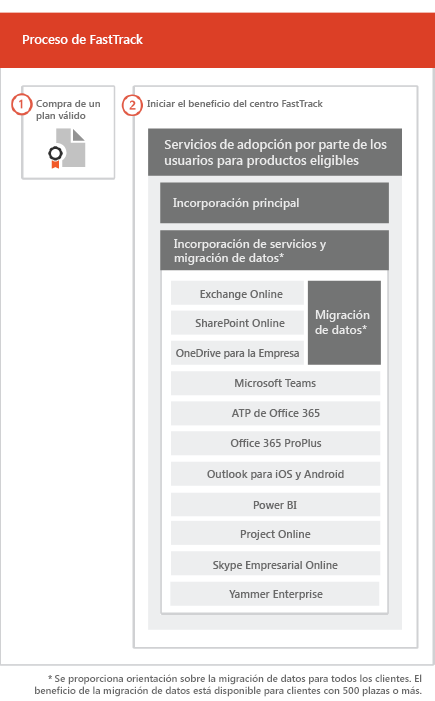

# Proceso de FastTrack

El proceso de FastTrack presta servicios relacionados con la incorporación y aceptación por parte de los usuarios. 
  
La incorporación consiste en lo siguiente:
  
- *Incorporación principal*: se trata de las tareas necesarias para la configuración de espacios empresariales y la integración con Azure Active Directory (Azure AD) si es necesario. La incorporación principal ofrece también la base de referencia para la incorporación de otros servicios elegibles. 
- *Incorporación y migración de servicios*: las tareas de incorporación de servicios habilitan escenarios en el espacio empresarial. Hablamos sobre la migración de datos (como archivos y correo electrónico) en [Migración de datos](O365-data-migration.md). 
    
Los servicios de aceptación por parte de los usuarios constan de tareas que le ayudarán a garantizar que los usuarios conozcan los servicios elegibles y puedan usarlos para impulsar el valor empresarial. Esta asistencia se presta en paralelo a las actividades de incorporación.
  
> [!NOTE]
> FastTrack proporciona a los clientes el enfoque, la orientación y los procedimientos recomendados diseñados para proporcionar resultados rápidos y previsibles. Si decide implementar sin tener en cuenta esta orientación, su experiencia de incorporación y uso del servicio pueden verse afectados. La orientación se define como una combinación de asistencia verbal y escrita. Cuando los especialistas de FastTrack proporcionan orientación, el personal de FastTrack no puede actuar en su nombre. Puede utilizar servicios de FastTrack para incorporar y adoptar cualquier carga de trabajo de producto cualificado mientras su suscripción sea válida.  
  
## Proceso de incorporación

En el siguiente diagrama se ilustra el proceso de incorporación.
  

  
Puede obtener ayuda a través del [Centro de administración de Office 365](https://go.microsoft.com/fwlink/?linkid=2032704) o en el [sitio de FastTrack](https://go.microsoft.com/fwlink/?linkid=780698). 

Para obtener ayuda en el [Centro de administración de Office 365](https://go.microsoft.com/fwlink/?linkid=2032704), el administrador necesita iniciar sesión y, después, hacer clic en el widget **¿Necesita ayuda?**. 

Para obtener ayuda a través del [sitio de FastTrack](https://go.microsoft.com/fwlink/?linkid=780698): 
1.  Inicie sesión en el [sitio de FastTrack](https://go.microsoft.com/fwlink/?linkid=780698). 
2.  Haga clic en **Servicios**.
3.  Complete el formulario **Solicitar asistencia para Microsoft 365**. 
> [!NOTE]
>  Si un partner aparece en su espacio empresarial de Office 365, no verá esta opción. Consulte a su partner para obtener asistencia. 
  
 También puede solicitar ayuda del Centro FastTrack en el [sitio de FastTrack](https://go.microsoft.com/fwlink/?linkid=780698) en la lista de servicios disponibles para su cuenta empresarial. 
    
 Una vez iniciada la asistencia de incorporación, programamos una serie de reuniones en línea.
    
Los partners también pueden obtener ayuda en el [sitio de FastTrack](https://go.microsoft.com/fwlink/?linkid=780698) en nombre de un cliente. Para hacerlo:
1.  Inicie sesión en el [sitio de FastTrack](https://go.microsoft.com/fwlink/?linkid=780698). 
2.  Haga clic en **Mis clientes**.
3.  Busque el cliente o selecciónelo en la lista de clientes.
4.  Haga clic en **Servicios**.
5.  Complete el formulario **Solicitar asistencia para Microsoft 365**. 

En la tabla siguiente se incluyen los roles y las responsabilidades para el proceso.
    
|||
|:-----|:-----|
|**Rol**   |**Responsabilidad**   |
|**Especialista de FastTrack**   |Ofrece todos los servicios de incorporación, migración y adopción de usuarios de forma remota.    Le ayuda de forma remota con una combinación de herramientas y documentación publicada.   Trabaja directamente con usted o su representante.   Proporciona orientación sobre la migración de datos y de correo electrónico.|
|**Centro de FastTrack**    |Ofrece orientación para la incorporación principal y de servicios, así como para la planeación de una adopción satisfactoria de los servicios elegibles.    Presta asistencia y está disponible durante el horario laboral normal de cada región.   Presta asistencia en chino tradicional y simplificado (el personal solo habla mandarín), inglés, francés, alemán, italiano, japonés, coreano, portugués (Brasil), español, tailandés y vietnamita.|

  

