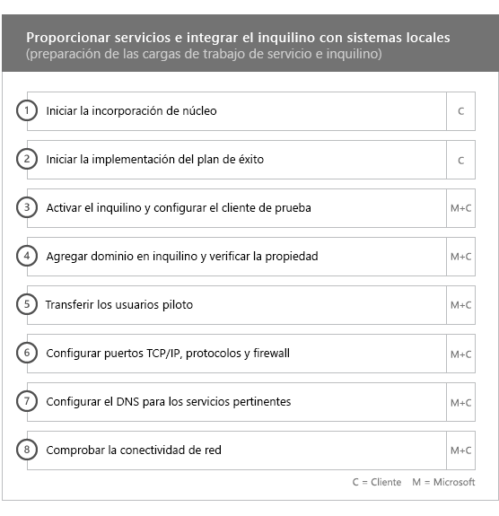
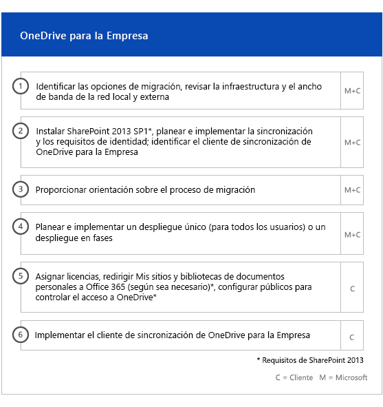
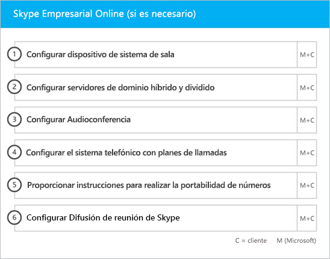

# Fases de incorporación y migración

Office 365 onboarding has four primary phases—Initiate, Assess, Remediate, and Enable. You can follow these phases with an optional data migration phase as shown in the following figure.
  

  
> [!NOTE]
>Para obtener información sobre la incorporación y migración para Office 365 Administración Pública, vea [Incorporación y migración para Office 365 Administración Pública](US-Gov-appendix-onboarding-and-migration.md). 

Para ver las tareas detalladas para cada fase, consulte [Responsabilidades de FastTrack](O365-fasttrack-responsibilities.md) y [Sus responsabilidades](O365-your-responsibilities.md).
  
## Fase de inicio

Después de adquirir el número y los tipos de licencias adecuados, siga las instrucciones que se indican en el correo electrónico de confirmación de compra para asociar las licencias a la cuenta empresarial existente o nueva. 
  
Puede obtener ayuda a través del [Centro de administración de Office 365](https://go.microsoft.com/fwlink/?linkid=2032704) o en el [sitio de FastTrack](https://go.microsoft.com/fwlink/?linkid=780698). 

Para obtener ayuda en el [Centro de administración de Office 365](https://go.microsoft.com/fwlink/?linkid=2032704), el administrador necesita iniciar sesión y, después, hacer clic en el widget **¿Necesita ayuda?**. 

Para obtener ayuda a través del [sitio de FastTrack](https://go.microsoft.com/fwlink/?linkid=780698): 
1.    Inicie sesión en el [sitio de FastTrack](https://go.microsoft.com/fwlink/?linkid=780698). 
2.    Seleccione **Solicitar asistencia para Microsoft 365** en **acciones rápidas**, situado en la parte superior de la página de aterrizaje, o bien seleccione **Solicitar asistencia para Microsoft 365** en la tarjeta de implementación.
3.    Complete el formulario **Solicitar asistencia para Microsoft 365**. 
  
Partners can also get help through the [FastTrack site](https://go.microsoft.com/fwlink/?linkid=780698) on behalf of a customer. To do so:
1.    Inicie sesión en el [sitio de FastTrack](https://go.microsoft.com/fwlink/?linkid=780698). 
2.    Haga clic en **Mis clientes**.
3.    Busque el cliente o selecciónelo en la lista de clientes.
4.    Haga clic en **Servicios**.
5.    Complete el formulario **Solicitar asistencia para Microsoft 365**.

También puede solicitar ayuda del Centro FastTrack en el [sitio de FastTrack](https://go.microsoft.com/fwlink/?linkid=780698) en la lista de servicios disponibles para su espacio empresarial. 
    
During this phase, we discuss the onboarding process, verify your data, and set up a kickoff meeting. This includes working with you to understand how you intend to use the service and your organization's goals and plans to drive service usage.
  

  
## Fase de evaluación

Your FastTrack Manager conducts an interactive success planning call with you and your adoption team. This introduces you to the capabilities of the eligible services you purchased, the key foundations you need for success, the methodology for driving usage of the service, and scenarios you can use to get value from the services. We assist you in success planning and provide feedback on key areas (as needed).
  
FastTrack Specialists work with you to assess your source environment and the requirements. We provide tools for you to gather data about your environment and  guide you through estimating bandwidth requirements and assessing your internet browsers, client operating systems, Domain Name System (DNS), network, infrastructure, and identity system to determine if any changes are required for onboarding. 
  
Based on your current setup, we provide a remediation plan that brings your source environment up to the minimum requirements for successful onboarding to Office 365 and, if needed, for successful mailbox and/or data migration. We provide a set of suggested activities to increase end user value and adoption. We also set up appropriate checkpoint calls for the Remediate phase.
  

  
## Fase de corrección

Debe llevar a cabo las tareas de corrección en función del entorno de origen, de modo que cumpla con los requisitos de incorporación, adopción y migración de cada uno de los servicios, según sea necesario.
  

  
We also provide a set of suggested activities to increase end user value and adoption. Before beginning the Enable phase, we jointly verify the outcomes of the remediation activities to make sure you're ready to proceed. 
  
Durante esta fase, el administrador de FastTrack trabaja con usted para diseñar un plan de éxito y le indica cuáles son los recursos adecuados y los procedimientos recomendados para poner el servicio a disposición de la organización y a impulsar su uso en todos los servicios.
  
## Fase de habilitación

Una vez concluidas todas las actividades de corrección, nos centramos en configurar la infraestructura básica del consumo del servicio, aprovisionar Office 365 y realizar las actividades para impulsar la adopción de servicios. 
  
## Incorporación principal

Core onboarding involves service provisioning and tenant and identity integration. It also includes steps for providing a foundation for onboarding services like Exchange Online, SharePoint Online, and Skype for Business Online. You and your FastTrack Manager continue to have success planning checkpoint meetings to evaluate progress against your goals and determine what further assistance you need.
  

  

  
> [!NOTE]
> WAP stands for Web Application Proxy. SSL stands for Secure Sockets Layer. SDS stands for School Data Sync. For more information on SDS, see [Welcome to Microsoft School Data Sync](https://go.microsoft.com/fwlink/?linkid=871480). 
  
La incorporación de uno o más servicios elegibles puede empezar al finalizar la incorporación principal.
  
## Exchange Online

For Exchange Online, we guide you through the process to get your organization ready to use email. The exact steps, depending on your source environment and your email migration plans, can include providing guidance for:
- Configuración de las características de Exchange Online Protection (EOP) para todos los dominios habilitados para correo que se han validado en Office 365.
    > [!NOTE]
    > Sus registros de correo Exchange (MX) deben referirse a Office 365. 
- Configurar la característica de Protección contra amenazas avanzada de Office 365 (ATP) si forma parte de su servicio de suscripción. Para obtener más información, vea la [Protección contra amenazas avanzada de Office 365](#office-365-advanced-threat-protection).
- Setting up the data loss prevention (DLP) feature for all mail-enabled domains validated in Office 365 as part of your subscription service. This is done once your MX records point to Office 365.
- Setting up Office 365 Message Encryption (OME) for all mail-enabled domains validated in Office 365 as part of your subscription service. This is done once your MX records point to Office 365.

> [!NOTE]
> El servicio de replicación de buzón (MRS) intenta migrar los mensajes de correo electrónico administrados por Information Rights Management (IRM) desde el buzón local hasta el buzón de Exchange Online correspondiente. La capacidad de leer el contenido protegido posterior a la migración dependerá de la asignación de clientes y la copia de las plantillas de Active Directory Rights Management Services (AD RMS) en el servicio Azure Rights Management (Azure RMS).

- Configurar puertos del firewall.
- Configuración de DNS, incluida la detección automática necesaria, el marco de directivas de remitente (SPF) y los registros MX (si procede). 
- Configuración del flujo de correo electrónico entre su entorno de mensajería de origen y Exchange Online (si procede).
- Operación de migración de correo desde el entorno de mensajería de origen a Office 365.
- Configuración de clientes de buzón (Outlook para Windows, Outlook en la web y Outlook para iOS y Android).
    > [!NOTE]
    > Para obtener más información sobre la migración de datos y correo, vea [Migración de datos](O365-data-migration.md). 
  

  
## SharePoint Online y OneDrive para la Empresa

En cuanto a SharePoint Online y OneDrive para la Empresa, se ofrecen instrucciones para:
- Configuración de DNS.
- Configuración de puertos del firewall.
- Aprovisionamiento de usuarios y licencias.   
- Configuración de las características de Entorno híbrido de SharePoint, como la búsqueda híbrida, los sitios híbridos, la taxonomía híbrida, los tipos de contenido, la creación híbrida de sitios sin intervención del administrador (solo SharePoint Server 2013), el iniciador de aplicaciones extendido, OneDrive para la Empresa híbrido y los sitios de extranet.
    
Los especialistas de FastTrack ofrecen orientación sobre la migración de datos a Office 365 mediante una combinación de herramientas y documentación, además de realizar una serie de tareas de configuración cuando corresponda y sea factible.
  

  
## OneDrive para la Empresa

En cuanto a OneDrive para la Empresa, los pasos dependen de si actualmente usa SharePoint y, si es así, de la versión que use. 
  

  
## Protección contra amenazas avanzada de Office 365

Para la ATP de Office 365, proporcionamos instrucciones para:
- Habilitar vínculos seguros, datos adjuntos seguros y protección contra suplantación de identidad (anti-phishing). 
- Configurar la automatización, la investigación y la respuesta.
- Usar el Simulador de ataques.
- Elaborar informes y análisis de amenazas.

## Gobierno de Información de Microsoft

Para la gobernanza de Información de Microsoft, proporcionamos instrucciones para:

- Gobernanza de la información.
- Etiquetas de retención y directivas.
- Administración de registros
- Directiva de eliminación
- Cumplimiento de comunicaciones
- Administración de riesgos internos 
- eDiscovery avanzado.

## Protección de Información de Microsoft

Para la protección de la Información de Microsoft, proporcionamos instrucciones para:
- Averigüe los datos en el explorador de contenido y en el explorador de actividades.
- Etiquetas de sensibilidad.
- Clasificación de los datos
- Las directivas de protección de pérdida de datos (DLP) de las charlas y canales de Microsoft Teams.
- Protección de la información.
- Etiquetado unificado.

## Microsoft Teams

En cuanto a Microsoft Teams, se ofrecen instrucciones para:
- Confirmación de requisitos mínimos.  
- Configuración de puertos del firewall.   
- Configuración de DNS. 
- Confirmando que se ha habilitado Microsoft Teams en su espacio empresarial de Office 365.  
- Habilitar o deshabilitar licencias de usuario.
    

## Skype Empresarial Online

En cuanto a Skype Empresarial Online, se ofrecen instrucciones para:
- Configuración de puertos del firewall.
- Configuración de DNS.   
- Creación de cuentas para cualquier dispositivo del sistema de la sala.   
- Implementación de un cliente de Skype Empresarial Online compatible.  
- Establecimiento de una configuración de servidores de dominio dividido entre el entorno de servidor local de Lync 2010, Lync 2013 o Skype Empresarial 2015 y un espacio empresarial de Skype Empresarial Online (si procede), planes de llamada, Difusión de reunión de Skype y sistema telefónico y planes de llamada (en los mercados disponibles).
    

  

  
## Power BI

En cuanto a Power BI, se ofrecen instrucciones para: 
- Asignación de licencias de Power BI.
- Implementación de la aplicación Power BI Desktop.
    
## Project Online

En cuanto a Project Online, se ofrecen instrucciones para:
  
- Comprobación de la funcionalidad básica de SharePoint que se basa en Project Online.   
- Adición del servicio de Project Online al espacio empresarial (incluida la adición de las suscripciones a los usuarios).  
- Configuración del grupo de recursos de empresa (ERP). 
- Creación del primer proyecto. 
    

  
## Project Online Professional y Project Online Premium

En cuanto a Project Online Professional y Project Online Premium, se ofrecen instrucciones para:
- Solucionar los problemas de implementación.
- Asignar licencias de usuario final mediante el [Centro de administración de Microsoft 365](https://go.microsoft.com/fwlink/?linkid=2032704) y Windows PowerShell.  
- Instalar Cliente de escritorio de Project Online desde el Portal de Office 365 con la opción Hacer clic y ejecutar.
- Configurar las opciones de actualización mediante la Herramienta de implementación de Office 365.  
- Configurar un servidor de distribución in situ único para Cliente de escritorio de Project Online, incluida la ayuda para crear un archivo configuration.xml para usarlo con la Herramienta de implementación de Office 365.  
- Conectar Cliente de escritorio de Project Online a Project Online Professional o Project Online Premium.
    

  
## Yammer Enterprise

En cuanto a Yammer, se ofrecen instrucciones para habilitar el servicio de Yammer Enterprise.
  
## Aplicaciones de Microsoft 365

Para Aplicaciones de Microsoft 365, proporcionamos instrucciones para:
- Solucionar los problemas de implementación.   
- Asignar licencias de usuario final y basadas en dispositivos mediante el [Centro de administración de Microsoft 365](https://go.microsoft.com/fwlink/?linkid=2032704) y Windows PowerShell. 
- Instalar Aplicaciones de Microsoft 365 desde el Portal de Office 365 con la opción Hacer clic y ejecutar.   
- Instalar aplicaciones de Office Mobile (como Outlook Mobile, Word Mobile, Excel Mobile y PowerPoint Mobile) en los dispositivos iOS o Android.   
- Configurar las opciones de actualización mediante la Herramienta de implementación de Office 365.   
- Selección y configuración de una instalación local o en la nube. 
- Creación de la configuración XML de la herramienta de implementación de Office con la herramienta de personalización de Office o XML nativo para configurar el paquete de implementación.  
- Implementar mediante Microsoft Endpoint Configuration Manager, incluida la ayuda con la creación del empaquetado de Microsoft Endpoint Configuration Manager.
    

  
## Outlook para iOS y Android

Con Outlook para iOS y Android, se proporcionan instrucciones para:
- Descargar Outlook para iOS y Android desde la App Store de Apple y Google Play.
- Configurar cuentas y acceder al buzón de Exchange Online.
