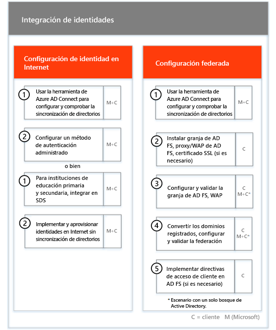
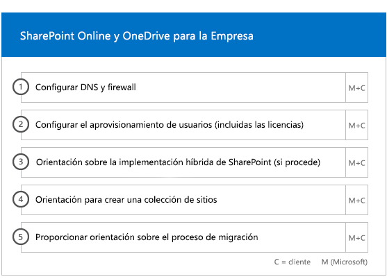

# Fases de incorporación y migraciónOnboarding and Migration Phases

Office 365 onboarding has four primary phases—Initiate, Assess, Remediate, and Enable.Office 365 onboarding has four primary phases—Initiate, Assess, Remediate, and Enable. You can follow these phases with an optional data migration phase as shown in the following figure.You can follow these phases with an optional data migration phase as shown in the following figure.
  

  
> [!NOTE]
>Para obtener información sobre la incorporación y migración para Office 365 Administración Pública, vea [Incorporación y migración para Office 365 Administración Pública](US-Gov-appendix-onboarding-and-migration.md).For information on onboarding and migration for Office 365 US Government, see [Onboarding and Migration for Office 365 US Government](US-Gov-appendix-onboarding-and-migration.md). 

Para ver las tareas detalladas para cada fase, consulte [Responsabilidades de FastTrack](O365-fasttrack-responsibilities.md) y [Sus responsabilidades](O365-your-responsibilities.md).For detailed tasks for each phase, see [FastTrack Responsibilities](O365-fasttrack-responsibilities.md) and [Your Responsibilities](O365-your-responsibilities.md).
  
## Fase de inicioInitiate phase

Después de adquirir el número y los tipos de licencias adecuados, siga las instrucciones que se indican en el correo electrónico de confirmación de compra para asociar las licencias a la cuenta empresarial existente o nueva.After you purchase the appropriate number and types of licenses, follow the guidance from the purchase confirmation email to associate the licenses to your existing or new tenant. 
  
Puede obtener ayuda a través del [Centro de administración de Office 365](https://go.microsoft.com/fwlink/?linkid=2032704) o en el [sitio de FastTrack](https://go.microsoft.com/fwlink/?linkid=780698).You can get help through the [Microsoft 365 admin center](https://go.microsoft.com/fwlink/?linkid=2032704) or the [FastTrack site](https://go.microsoft.com/fwlink/?linkid=780698). 

Para obtener ayuda en el [Centro de administración de Office 365](https://go.microsoft.com/fwlink/?linkid=2032704), el administrador necesita iniciar sesión y, después, hacer clic en el widget **¿Necesita ayuda?**.To get help through the [Microsoft 365 admin center](https://go.microsoft.com/fwlink/?linkid=2032704), your admin signs into the admin center and then clicks the **Need help?** widget. 

Para obtener ayuda a través del [sitio de FastTrack](https://go.microsoft.com/fwlink/?linkid=780698):To get help through the [FastTrack site](https://go.microsoft.com/fwlink/?linkid=780698): 
1.    Inicie sesión en el [sitio de FastTrack](https://go.microsoft.com/fwlink/?linkid=780698).Sign in to the [FastTrack site](https://go.microsoft.com/fwlink/?linkid=780698). 
2.    Seleccione **Solicitar asistencia para Microsoft 365** en **acciones rápidas**, situado en la parte superior de la página de aterrizaje, o bien seleccione **Solicitar asistencia para Microsoft 365** en la tarjeta de implementación.Select **Request assistance for Microsoft 365** from the **quick actions** on the top of your landing page or by selecting **Request assistance for Microsoft 365** on the deploy card.
3.    Complete el formulario **Solicitar asistencia para Microsoft 365**.Complete the **Request Assistance for Microsoft 365** form. 
  
Partners can also get help through the [FastTrack site](https://go.microsoft.com/fwlink/?linkid=780698) on behalf of a customer.Partners can also get help through the [FastTrack site](https://go.microsoft.com/fwlink/?linkid=780698) on behalf of a customer. To do so:To do so:
1.    Inicie sesión en el [sitio de FastTrack](https://go.microsoft.com/fwlink/?linkid=780698).Sign in to the [FastTrack site](https://go.microsoft.com/fwlink/?linkid=780698). 
2.    Haga clic en **Mis clientes**.Select **My Customers**.
3.    Busque el cliente o selecciónelo en la lista de clientes.Search for your customer or select them from your customer list.
4.    Haga clic en **Servicios**.Select **Services**.
5.    Complete el formulario **Solicitar asistencia para Microsoft 365**.Complete the **Request Assistance for Microsoft 365** form.

También puede solicitar ayuda del Centro FastTrack en el [sitio de FastTrack](https://go.microsoft.com/fwlink/?linkid=780698) en la lista de servicios disponibles para su espacio empresarial.You can also ask for FastTrack Center help from the [FastTrack site](https://go.microsoft.com/fwlink/?linkid=780698) in the list of available services for your tenant. 
    
During this phase, we discuss the onboarding process, verify your data, and set up a kickoff meeting.During this phase, we discuss the onboarding process, verify your data, and set up a kickoff meeting. This includes working with you to understand how you intend to use the service and your organization's goals and plans to drive service usage.This includes working with you to understand how you intend to use the service and your organization's goals and plans to drive service usage.
  

  
## Fase de evaluaciónAssess phase

Your FastTrack Manager conducts an interactive success planning call with you and your adoption team.Your FastTrack Manager conducts an interactive success planning call with you and your adoption team. This introduces you to the capabilities of the eligible services you purchased, the key foundations you need for success, the methodology for driving usage of the service, and scenarios you can use to get value from the services.This introduces you to the capabilities of the eligible services you purchased, the key foundations you need for success, the methodology for driving usage of the service, and scenarios you can use to get value from the services. We assist you in success planning and provide feedback on key areas (as needed).We assist you in success planning and provide feedback on key areas (as needed).
  
FastTrack Specialists work with you to assess your source environment and the requirements.FastTrack Specialists work with you to assess your source environment and the requirements. We provide tools for you to gather data about your environment and  guide you through estimating bandwidth requirements and assessing your internet browsers, client operating systems, Domain Name System (DNS), network, infrastructure, and identity system to determine if any changes are required for onboarding.We provide tools for you to gather data about your environment and  guide you through estimating bandwidth requirements and assessing your internet browsers, client operating systems, Domain Name System (DNS), network, infrastructure, and identity system to determine if any changes are required for onboarding. 
  
Based on your current setup, we provide a remediation plan that brings your source environment up to the minimum requirements for successful onboarding to Office 365 and, if needed, for successful mailbox and/or data migration.Based on your current setup, we provide a remediation plan that brings your source environment up to the minimum requirements for successful onboarding to Office 365 and, if needed, for successful mailbox and/or data migration. We provide a set of suggested activities to increase end user value and adoption.We provide a set of suggested activities to increase end user value and adoption. We also set up appropriate checkpoint calls for the Remediate phase.We also set up appropriate checkpoint calls for the Remediate phase.
  

  
## Fase de correcciónRemediate phase

Debe llevar a cabo las tareas de corrección en función del entorno de origen, de modo que cumpla con los requisitos de incorporación, adopción y migración de cada uno de los servicios, según sea necesario.You do the remediation tasks based on your source environment so that you meet the requirements for onboarding, adopting, and migrating each service as needed.
  

  
We also provide a set of suggested activities to increase end user value and adoption.We also provide a set of suggested activities to increase end user value and adoption. Before beginning the Enable phase, we jointly verify the outcomes of the remediation activities to make sure you're ready to proceed.Before beginning the Enable phase, we jointly verify the outcomes of the remediation activities to make sure you're ready to proceed. 
  
Durante esta fase, el administrador de FastTrack trabaja con usted para diseñar un plan de éxito y le indica cuáles son los recursos adecuados y los procedimientos recomendados para poner el servicio a disposición de la organización y a impulsar su uso en todos los servicios.During this phase, your FastTrack Manager works with you on success planning, guiding you to the right resources and best practices to provide guidance for you to make the service available to your organization and drive usage across the services.
  
## Fase de habilitaciónEnable phase

Una vez concluidas todas las actividades de corrección, nos centramos en configurar la infraestructura básica del consumo del servicio, aprovisionar Office 365 y realizar las actividades para impulsar la adopción de servicios.When all remediation activities are complete, the focus shifts to configuring the core infrastructure for service consumption, provisioning Office 365, and conducting the activities to drive service adoption. 
  
## Incorporación principalCore

Core onboarding involves service provisioning and tenant and identity integration.Core onboarding involves service provisioning and tenant and identity integration. It also includes steps for providing a foundation for onboarding services like Exchange Online, SharePoint Online, and Skype for Business Online.It also includes steps for providing a foundation for onboarding services like Exchange Online, SharePoint Online, and Skype for Business Online. You and your FastTrack Manager continue to have success planning checkpoint meetings to evaluate progress against your goals and determine what further assistance you need.You and your FastTrack Manager continue to have success planning checkpoint meetings to evaluate progress against your goals and determine what further assistance you need.
  

  

  
> [!NOTE]
> WAP stands for Web Application Proxy.WAP stands for Web Application Proxy. SSL stands for Secure Sockets Layer.SSL stands for Secure Sockets Layer. SDS stands for School Data Sync. For more information on SDS, see [Welcome to Microsoft School Data Sync](https://go.microsoft.com/fwlink/?linkid=871480).SDS stands for School Data Sync. For more information on SDS, see [Welcome to Microsoft School Data Sync](https://go.microsoft.com/fwlink/?linkid=871480). 
  
La incorporación de uno o más servicios elegibles puede empezar al finalizar la incorporación principal.Onboarding for one or more eligible services can begin once core onboarding is finished.
  
## Exchange OnlineExchange Online

For Exchange Online, we guide you through the process to get your organization ready to use email.For Exchange Online, we guide you through the process to get your organization ready to use email. The exact steps, depending on your source environment and your email migration plans, can include providing guidance for:The exact steps, depending on your source environment and your email migration plans, can include providing guidance for:
- Configuración de las características de Exchange Online Protection (EOP) para todos los dominios habilitados para correo que se han validado en Office 365.Setting up Exchange Online Protection (EOP) features for all mail-enabled domains validated in Office 365.
    > [!NOTE]
    > Sus registros de correo Exchange (MX) deben referirse a Office 365.Your mail exchange (MX) records must point to Office 365. 
- Configurar la característica de Protección contra amenazas avanzada de Office 365 (ATP) si forma parte de su servicio de suscripción.Setting up the Office 365 Advanced Threat Protection (ATP) feature if it's part of your subscription service. Para obtener más información, vea la [Protección contra amenazas avanzada de Office 365](#office-365-advanced-threat-protection).For more information, see [Office 365 Advanced Threat Protection](#office-365-advanced-threat-protection).
- Setting up the data loss prevention (DLP) feature for all mail-enabled domains validated in Office 365 as part of your subscription service.Setting up the data loss prevention (DLP) feature for all mail-enabled domains validated in Office 365 as part of your subscription service. This is done once your MX records point to Office 365.This is done once your MX records point to Office 365.
- Setting up Office 365 Message Encryption (OME) for all mail-enabled domains validated in Office 365 as part of your subscription service.Setting up Office 365 Message Encryption (OME) for all mail-enabled domains validated in Office 365 as part of your subscription service. This is done once your MX records point to Office 365.This is done once your MX records point to Office 365.

> [!NOTE]
> El servicio de replicación de buzón (MRS) intenta migrar los mensajes de correo electrónico administrados por Information Rights Management (IRM) desde el buzón local hasta el buzón de Exchange Online correspondiente.The Mailbox Replication service (MRS) attempts to migrate Information Rights Managed (IRM) emails from your on-premises mailbox to the corresponding Exchange Online mailbox. La capacidad de leer el contenido protegido posterior a la migración dependerá de la asignación de clientes y la copia de las plantillas de Active Directory Rights Management Services (AD RMS) en el servicio Azure Rights Management (Azure RMS).Ability to read the protected content post-migration depends on the customer mapping and copying Active Directory Rights Managed Services (AD RMS) templates to the Azure Rights Management Service (Azure RMS).

- Configurar puertos del firewall.Configuring firewall ports.
- Configuración de DNS, incluida la detección automática necesaria, el marco de directivas de remitente (SPF) y los registros MX (si procede).Setting up DNS, including the required Autodiscover, sender policy framework (SPF), and MX records (as needed). 
- Configuración del flujo de correo electrónico entre su entorno de mensajería de origen y Exchange Online (si procede).Setting up email flow between your source messaging environment and Exchange Online (as needed).
- Operación de migración de correo desde el entorno de mensajería de origen a Office 365.Undertaking mail migration from your source messaging environment to Office 365.
- Configuración de clientes de buzón (Outlook para Windows, Outlook en la web y Outlook para iOS y Android).Configuring mailbox clients (Outlook for Windows, Outlook on the web, and Outlook for iOS and Android).
    > [!NOTE]
    > Para obtener más información sobre la migración de datos y correo, vea [Migración de datos](O365-data-migration.md).For more information on mail and data migration, see [Data Migration](O365-data-migration.md). 
  

  
## SharePoint Online y OneDrive para la EmpresaSharePoint Online and OneDrive for Business

En cuanto a SharePoint Online y OneDrive para la Empresa, se ofrecen instrucciones para:For SharePoint Online and OneDrive for Business, we provide guidance for:
- Configuración de DNS.Setting up DNS.
- Configuración de puertos del firewall.Configuring firewall ports.
- Aprovisionamiento de usuarios y licencias.Provisioning users and licenses.   
- Configuración de las características de Entorno híbrido de SharePoint, como la búsqueda híbrida, los sitios híbridos, la taxonomía híbrida, los tipos de contenido, la creación híbrida de sitios sin intervención del administrador (solo SharePoint Server 2013), el iniciador de aplicaciones extendido, OneDrive para la Empresa híbrido y los sitios de extranet.Configuring SharePoint hybrid features, like hybrid search, hybrid sites, hybrid taxonomy, content types, hybrid self-service site creation (SharePoint Server 2013 only), extended app launcher, hybrid OneDrive for Business, and extranet sites.
    
Los especialistas de FastTrack ofrecen orientación sobre la migración de datos a Office 365 mediante una combinación de herramientas y documentación, además de realizar una serie de tareas de configuración cuando corresponda y sea factible.FastTrack Specialists provide guidance on data migration to Office 365 by using a combination of tools and documentation and by performing configuration tasks where applicable and feasible.
  

  
## OneDrive para la EmpresaOneDrive for Business

En cuanto a OneDrive para la Empresa, los pasos dependen de si actualmente usa SharePoint y, si es así, de la versión que use.For OneDrive for Business, the steps depend on if you're currently using SharePoint, and if so, which version. 
  

  
## Protección contra amenazas avanzada de Office 365Office 365 Advanced Threat Protection

Para la ATP de Office 365, proporcionamos instrucciones para:For Office 365 ATP, we provide guidance for:
- Habilitar vínculos seguros, datos adjuntos seguros y protección contra suplantación de identidad (anti-phishing).Enabling Safe Links, Safe Attachments, and anti-phishing. 
- Configurar la automatización, la investigación y la respuesta.Configuring automation, investigation, and response.
- Usar el Simulador de ataques.Using Attack Simulator.
- Elaborar informes y análisis de amenazas.Reporting and threat analytics.

## Gobierno de Información de MicrosoftMicrosoft Information Governance

Para la gobernanza de Información de Microsoft, proporcionamos instrucciones para:For Microsoft Information Governance, we provide guidance for:

- Gobernanza de la información.Information governance.
- Etiquetas de retención y directivas.Retention labels and policies.
- Administración de registrosRecords management.
- Directiva de eliminaciónDeletion policies.
- Cumplimiento de comunicacionesCommunication compliance.
- Administración de riesgos internosInsider risk management 
- eDiscovery avanzado.Advanced eDiscovery.

## Protección de Información de MicrosoftMicrosoft Information Protection

Para la protección de la Información de Microsoft, proporcionamos instrucciones para:For Microsoft Information Protection, we provide guidance for:
- Averigüe los datos en el explorador de contenido y en el explorador de actividades.Know your data through content explorer and activity explorer.
- Etiquetas de sensibilidad.Sensitivity labels.
- Clasificación de los datosData classification.
- Las directivas de protección de pérdida de datos (DLP) de las charlas y canales de Microsoft Teams.Data loss protection (DLP) policies for Microsoft Teams chats and channels.
- Protección de la información.Information protection.
- Etiquetado unificado.Unified labeling.

## Microsoft TeamsMicrosoft Teams

En cuanto a Microsoft Teams, se ofrecen instrucciones para:For Microsoft Teams, we provide guidance for:
- Confirmación de requisitos mínimos.Confirming minimum requirements.  
- Configuración de puertos del firewall.Configuring firewall ports.   
- Configuración de DNS.Setting up DNS. 
- Confirmando que se ha habilitado Microsoft Teams en su espacio empresarial de Office 365.Confirming Microsoft Teams is enabled on your Office 365 tenant.  
- Habilitar o deshabilitar licencias de usuario.Enabling or disabling user licenses.
    

## Skype Empresarial OnlineSkype for Business Online

En cuanto a Skype Empresarial Online, se ofrecen instrucciones para:For Skype for Business Online, we provide guidance for:
- Configuración de puertos del firewall.Configuring firewall ports.
- Configuración de DNS.Setting up DNS.   
- Creación de cuentas para cualquier dispositivo del sistema de la sala.Creating accounts for any room system devices.   
- Implementación de un cliente de Skype Empresarial Online compatible.Deploying a supported Skype for Business Online client.  
- Establecimiento de una configuración de servidores de dominio dividido entre el entorno de servidor local de Lync 2010, Lync 2013 o Skype Empresarial 2015 y un espacio empresarial de Skype Empresarial Online (si procede), planes de llamada, Difusión de reunión de Skype y sistema telefónico y planes de llamada (en los mercados disponibles).Establishing split domain server configuration between your on-premises Lync 2010, Lync 2013, or Skype for Business 2015 server environment and Skype for Business Online tenant (if applicable), Calling Plans, Skype Meeting Broadcast, and Phone System and Calling Plans (in available markets).
    

  

  
## Power BIPower BI

En cuanto a Power BI, se ofrecen instrucciones para:For Power BI, we provide guidance for: 
- Asignación de licencias de Power BI.Assigning Power BI licenses.
- Implementación de la aplicación Power BI Desktop.Deploying the Power BI Desktop app.
    
## Project OnlineProject Online

En cuanto a Project Online, se ofrecen instrucciones para:For Project Online, we provide guidance for:
  
- Comprobación de la funcionalidad básica de SharePoint que se basa en Project Online.Verifying basic SharePoint functionality that Project Online relies on.   
- Adición del servicio de Project Online al espacio empresarial (incluida la adición de las suscripciones a los usuarios).Adding the Project Online service to your tenant (including adding subscriptions to users).  
- Configuración del grupo de recursos de empresa (ERP).Setting up the Enterprise Resource Pool (ERP). 
- Creación del primer proyecto.Creating your first project. 
    

  
## Project Online Professional y Project Online PremiumProject Online Professional and Project Online Premium

En cuanto a Project Online Professional y Project Online Premium, se ofrecen instrucciones para:For Project Online Professional and Project Online Premium, we provide guidance for:
- Solucionar los problemas de implementación.Addressing deployment issues.
- Asignar licencias de usuario final mediante el [Centro de administración de Microsoft 365](https://go.microsoft.com/fwlink/?linkid=2032704) y Windows PowerShell.Assigning end-user licenses using the [Microsoft 365 admin center](https://go.microsoft.com/fwlink/?linkid=2032704) and Windows PowerShell.  
- Instalar Cliente de escritorio de Project Online desde el Portal de Office 365 con la opción Hacer clic y ejecutar.Installing Project Online Desktop Client from the Office 365 portal using Click-to-Run.
- Configurar las opciones de actualización mediante la Herramienta de implementación de Office 365.Configuring update settings using the Office 365 Deployment Tool.  
- Configurar un servidor de distribución in situ único para Cliente de escritorio de Project Online, incluida la ayuda para crear un archivo configuration.xml para usarlo con la Herramienta de implementación de Office 365.Setting up a single on-site distribution server for Project Online Desktop Client, including assistance with the creation of a configuration.xml file for use with the Office 365 Deployment Tool.  
- Conectar Cliente de escritorio de Project Online a Project Online Professional o Project Online Premium.Connecting Project Online Desktop Client to Project Online Professional or Project Online Premium.
    

  
## Yammer EnterpriseYammer Enterprise

En cuanto a Yammer, se ofrecen instrucciones para habilitar el servicio de Yammer Enterprise.For Yammer, we provide guidance for enabling the Yammer Enterprise service.
  
## Aplicaciones de Microsoft 365Microsoft 365 Apps

Para Aplicaciones de Microsoft 365, proporcionamos instrucciones para:For Microsoft 365 Apps, we provide guidance for:
- Solucionar los problemas de implementación.Addressing deployment issues.   
- Asignar licencias de usuario final y basadas en dispositivos mediante el [Centro de administración de Microsoft 365](https://go.microsoft.com/fwlink/?linkid=2032704) y Windows PowerShell.Assigning end-user and device-based licenses using the [Microsoft 365 admin center](https://go.microsoft.com/fwlink/?linkid=2032704) and Windows PowerShell. 
- Instalar Aplicaciones de Microsoft 365 desde el Portal de Office 365 con la opción Hacer clic y ejecutar.Installing Microsoft 365 Apps from the Office 365 portal using Click-to-Run.   
- Instalar aplicaciones de Office Mobile (como Outlook Mobile, Word Mobile, Excel Mobile y PowerPoint Mobile) en los dispositivos iOS o Android.Installing Office Mobile apps (like Outlook Mobile, Word Mobile, Excel Mobile, and PowerPoint Mobile) on your iOS or Android devices.   
- Configurar las opciones de actualización mediante la Herramienta de implementación de Office 365.Configuring update settings using the Office 365 Deployment Tool.   
- Selección y configuración de una instalación local o en la nube.Selection and setup of a local or cloud installation. 
- Creación de la configuración XML de la herramienta de implementación de Office con la herramienta de personalización de Office o XML nativo para configurar el paquete de implementación.Creation of the Office Deployment Tool configuration XML with the Office Customization Tool or native XML to configure the deployment package.  
- Implementar mediante Microsoft Endpoint Configuration Manager, incluida la ayuda con la creación del empaquetado de Microsoft Endpoint Configuration Manager.Deployment using Microsoft Endpoint Configuration Manager, including assistance with the creation of Microsoft Endpoint Configuration Manager packaging.
    

  
## Outlook para iOS y AndroidOutlook for iOS and Android

Con Outlook para iOS y Android, se proporcionan instrucciones para:For Outlook for iOS and Android, we provide guidance for:
- Descargar Outlook para iOS y Android desde la App Store de Apple y Google Play.Downloading Outlook for iOS and Android from the Apple App Store and Google Play.
- Configurar cuentas y acceder al buzón de Exchange Online.Configuring accounts and accessing the Exchange Online mailbox.
