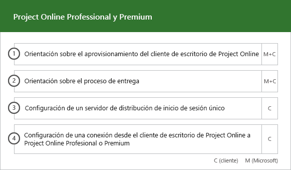
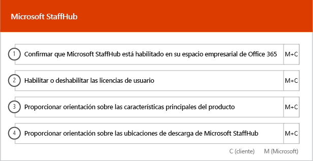

# Fases de incorporación y migraciónOnboarding and Migration Phases

La incorporación de Office 365 consta de cuatro fases principales: inicio, evaluación, corrección y habilitación. Puede seguir estas fases con una fase opcional de migración de datos, tal como se muestra en la figura siguiente.Office 365 onboarding has four primary phases—Initiate, Assess, Remediate, and Enable. You can follow these phases with an optional data migration phase as shown in the following figure.
  

  
> [!NOTE]
>Para obtener información sobre la incorporación y migración para Office 365 Administración Pública, vea [Incorporación y migración para Office 365 Administración Pública](US-Gov-appendix-onboarding-and-migration.md).For information on onboarding and migration for Office 365 US Government, see [Onboarding and Migration for Office 365 US Government](US-Gov-appendix-onboarding-and-migration.md). 

Para ver las tareas detalladas para cada fase, consulte [Responsabilidades de FastTrack](O365-fasttrack-responsibilities.md) y [Sus responsabilidades](O365-your-responsibilities.md).For detailed tasks for each phase, see [FastTrack Responsibilities](O365-fasttrack-responsibilities.md) and [Your Responsibilities](O365-your-responsibilities.md).
  
## Fase de inicioInitiate phase

Después de adquirir el número y los tipos de licencias adecuados, siga las instrucciones que se indican en el correo electrónico de confirmación de compra para asociar las licencias a la cuenta empresarial existente o nueva.After you purchase the appropriate number and types of licenses, follow the guidance from the purchase confirmation email to associate the licenses to your existing or new tenant. 
  
Puede obtener ayuda en el Centro de administración de Office 365 o en el [sitio de FastTrack](https://go.microsoft.com/fwlink/?linkid=780698). Para obtener ayuda en el Centro de administración de Office 365, el administrador debe iniciar sesión en él y, a continuación, hacer clic en el widget **¿Necesita ayuda?** Para obtener ayuda en el [sitio de FastTrack](https://go.microsoft.com/fwlink/?linkid=780698), inicie sesión, haga clic en **Servicios** y complete el formulario **Solicitar asistencia para Office 365**.You can get help through the Office 365 admin center or the [FastTrack site](https://go.microsoft.com/fwlink/?linkid=780698). To get help through the Office 365 admin center, your admin signs into the admin center and then clicks the **Need help?** widget. To get help through the [FastTrack site](https://go.microsoft.com/fwlink/?linkid=780698), sign in, click **Services**, and complete the **Request Assistance for Office 365** form. 
    
> [!NOTE]
>  Si un asociado aparece en su espacio empresarial de Office 365, no verá esta opción. Consulte a su asociado para obtener asistencia.If you have a partner listed in your Office 365 tenant, you won't see this option. Please consult your partner for assistance. 
  
Los partners también pueden obtener ayuda en el [sitio de FastTrack](https://go.microsoft.com/fwlink/?linkid=780698) en nombre de un cliente. Para ello, el partner debe iniciar sesión en el sitio, seleccionar el registro del cliente, hacer clic en **Servicios** y completar el formulario **Solicitar asistencia para Office 365**.Partners can also get help through the [FastTrack site](https://go.microsoft.com/fwlink/?linkid=780698) on behalf of a customer. To do so, the partner signs in to the site, selects the customer record, clicks **Services**, and completes the **Request Assistance for Office 365** form. 

También puede solicitar ayuda del Centro FastTrack en el [sitio de FastTrack](https://go.microsoft.com/fwlink/?linkid=780698) en la lista de servicios disponibles para su cuenta empresarial.You can also ask for FastTrack Center help from the [FastTrack site](https://go.microsoft.com/fwlink/?linkid=780698) in the list of available services for your tenant. 
    
Durante esta fase, se debate sobre el proceso de incorporación, se comprueban los datos y se configura una reunión de inicio. Esto incluye analizar con usted cómo pretende usar el servicio, así como los objetivos y los planes de su organización para dirigir el uso del servicio.During this phase, we discuss the onboarding process, verify your data, and set up a kickoff meeting. This includes working with you to understand how you intend to use the service and your organization's goals and plans to drive service usage.
  

  
## Fase de evaluaciónAssess phase

El administrador de FastTrack realiza con usted y con su equipo de adopción una llamada interactiva del plan de éxito. De este modo, tiene acceso a las funciones de los servicios pertinentes que adquirió, los puntos clave que necesita para lograr el éxito, la metodología para impulsar el uso del servicio y los escenarios que puede usar para aprovechar los servicios. Le ofrecemos asistencia para que diseñe un plan de éxito y le enviamos comentarios sobre las áreas fundamentales (según sea necesario).Your FastTrack Manager conducts an interactive success planning call with you and your adoption team. This introduces you to the capabilities of the eligible services you purchased, the key foundations you need for success, the methodology for driving usage of the service, and scenarios you can use to get value from the services. We assist you in success planning and provide feedback on key areas (as needed).
  
Los especialistas de FastTrack trabajan con usted para evaluar su entorno de origen y los requisitos. Le proporcionamos herramientas para recopilar datos sobre su entorno y le guiamos durante la estimación de los requisitos de ancho de banda y la evaluación de los exploradores de Internet, los sistemas operativos cliente, el Sistema de nombres de dominio (DNS), la red, la infraestructura y el sistema de identidad para determinar si se deben efectuar cambios para la incorporación.FastTrack Specialists work with you to assess your source environment and the requirements. We provide tools for you to gather data about your environment and  guide you through estimating bandwidth requirements and assessing your internet browsers, client operating systems, Domain Name System (DNS), network, infrastructure, and identity system to determine if any changes are required for onboarding. 
  
Según la configuración actual, le ofrecemos un plan de corrección que lleva el entorno de origen a los requisitos mínimos para efectuar una incorporación correcta a Office 365 y, en caso necesario, para llevar a cabo una migración correcta del buzón de correo o de los datos. Le proporcionamos una serie de actividades sugeridas para aumentar el valor y la aceptación por parte de los usuarios finales. Asimismo, configuramos llamadas al punto de control para la fase de corrección.Based on your current setup, we provide a remediation plan that brings your source environment up to the minimum requirements for successful onboarding to Office 365 and, if needed, for successful mailbox and/or data migration. We provide a set of suggested activities to increase end user value and adoption. We also set up appropriate checkpoint calls for the Remediate phase.
  

  
## Fase de correcciónRemediate phase

Debe llevar a cabo las tareas de corrección en función del entorno de origen, de modo que cumpla con los requisitos de incorporación, adopción y migración de cada uno de los servicios, según sea necesario.You do the remediation tasks based on your source environment so that you meet the requirements for onboarding, adopting, and migrating each service as needed.
  

  
También ofrecemos una serie de actividades sugeridas para aumentar el valor y la aceptación por parte de los usuarios finales. Antes de iniciar la fase de habilitación, comprobamos conjuntamente los resultados de las actividades de corrección para garantizar que está listo para continuar.We also provide a set of suggested activities to increase end user value and adoption. Before beginning the Enable phase, we jointly verify the outcomes of the remediation activities to make sure you're ready to proceed. 
  
Durante esta fase, el administrador de FastTrack trabaja con usted para diseñar un plan de éxito y le indica cuáles son los recursos adecuados y los procedimientos recomendados para poner el servicio a disposición de la organización y a impulsar su uso en todos los servicios.During this phase, your FastTrack Manager works with you on success planning, guiding you to the right resources and best practices to provide guidance for you to make the service available to your organization and drive usage across the services.
  
## Fase de habilitaciónEnable phase

Una vez concluidas todas las actividades de corrección, nos centramos en configurar la infraestructura básica del consumo del servicio, aprovisionar Office 365 y realizar las actividades para impulsar la adopción de servicios.When all remediation activities are complete, the focus shifts to configuring the core infrastructure for service consumption, provisioning Office 365, and conducting the activities to drive service adoption. 
  
## Incorporación principalCore

La incorporación principal implica el aprovisionamiento de servicios y la integración de espacios empresariales e identidades. También incluye pasos para proporcionar las bases para la incorporación de servicios como Exchange Online, SharePoint Online y Skype Empresarial Online. Usted y el administrador de FastTrack seguirán celebrando las reuniones de los puntos de control del plan de éxito para evaluar el progreso en relación con los objetivos y determinar qué asistencia adicional necesita.Core onboarding involves service provisioning and tenant and identity integration. It also includes steps for providing a foundation for onboarding services like Exchange Online, SharePoint Online, and Skype for Business Online. You and your FastTrack Manager continue to have success planning checkpoint meetings to evaluate progress against your goals and determine what further assistance you need.
  

  

  
> [!NOTE]
> WAP son las siglas de Proxy de aplicación web. SSL son las siglas de Capa de sockets seguros. SDS son las siglas de School Data Sync Para obtener más información sobre SDS, consulte [Le damos la bienvenida a School Data Sync de Microsoft](https://go.microsoft.com/fwlink/?linkid=871480).WAP stands for Web Application Proxy. SSL stands for Secure Sockets Layer. SDS stands for School Data Sync. For more information on SDS, see [Welcome to Microsoft School Data Sync](https://go.microsoft.com/fwlink/?linkid=871480). 
  
La incorporación de uno o más servicios elegibles puede empezar al finalizar la incorporación principal.Onboarding for one or more eligible services can begin once core onboarding is finished.
  
## Exchange OnlineExchange Online

En cuanto a Exchange Online, le guiamos a lo largo del proceso para preparar la organización para usar el correo electrónico. Los pasos exactos dependen del entorno de origen y de sus planes de migración de correo electrónico. Pueden incluir instrucciones para:For Exchange Online, we guide you through the process to get your organization ready to use email. The exact steps, depending on your source environment and your email migration plans, can include providing guidance for:
- Configuración de las características de Exchange Online Protection (EOP) para todos los dominios habilitados para correo que se han validado en Office 365.Setting up Exchange Online Protection (EOP) features for all mail-enabled domains validated in Office 365.
    > [!NOTE]
    > Sus registros de correo Exchange (MX) deben referirse a Office 365.Your mail exchange (MX) records must point to Office 365. 
- Configuración de la característica de Protección contra amenazas avanzada de Exchange Online (ATP) si forma parte de su servicio de suscripción una vez que sus registros MX apunten a Office 365. Esta característica está configurada como parte de la configuración antimalware de Protección de Exchange Online.Setting up the Exchange Online Advanced Threat Protection (ATP) feature if it's part of your subscription service once your MX records point to Office 365. This feature is configured as part of the Exchange Online Protection antimalware settings.
- Configuración de puertos del firewall.Configuring firewall ports.
- Configuración de DNS, incluida la detección automática necesaria, el marco de directivas de remitente (SPF) y los registros MX (si procede).Setting up DNS, including the required Autodiscover, sender policy framework (SPF), and MX records (as needed). 
- Configuración del flujo de correo electrónico entre su entorno de mensajería de origen y Exchange Online (si procede).Setting up email flow between your source messaging environment and Exchange Online (as needed).
- Operación de migración de correo desde el entorno de mensajería de origen a Office 365.Undertaking mail migration from your source messaging environment to Office 365.
    > [!NOTE]
    > Para obtener más información sobre la migración de datos y correo, consulte [Migración de datos](O365-data-migration.md).For more information on mail and data migration, see [Data Migration](O365-data-migration.md). 
  

  
## SharePoint Online y OneDrive para la EmpresaSharePoint Online and OneDrive for Business

En cuanto a SharePoint Online y OneDrive para la Empresa, se ofrecen instrucciones para:For SharePoint Online and OneDrive for Business, we provide guidance for:
- Configuración de DNS.Setting up DNS.
- Configuración de puertos del firewall.Configuring firewall ports.
- Aprovisionamiento de usuarios y licencias.Provisioning users and licenses.   
- Configuración de las características de Entorno híbrido de SharePoint, como la búsqueda híbrida, los sitios híbridos, la taxonomía híbrida, los tipos de contenido, la creación híbrida de sitios sin intervención del administrador (solo SharePoint Server 2013), el iniciador de aplicaciones extendido, OneDrive para la Empresa híbrido y los sitios de extranet.Configuring SharePoint Hybrid features, like hybrid search, hybrid sites, hybrid taxonomy, content types, hybrid self-service site creation (SharePoint Server 2013 only), extended app launcher, hybrid OneDrive for Business, and extranet sites.
    
Los especialistas de FastTrack ofrecen orientación sobre la migración de datos a Office 365 mediante una combinación de herramientas y documentación, además de realizar una serie de tareas de configuración cuando corresponda y sea factible.FastTrack Specialists provide guidance on data migration to Office 365 by using a combination of tools and documentation and by performing configuration tasks where applicable and feasible.
  

  
## OneDrive para la EmpresaOneDrive for Business

En cuanto a OneDrive para la Empresa, los pasos dependen de si actualmente usa SharePoint y, si es así, de la versión que use.For OneDrive for Business, the steps depend on if you're currently using SharePoint, and if so, which version. 
  

  
## Skype Empresarial OnlineSkype for Business Online

En cuanto a Skype Empresarial Online, se ofrecen instrucciones para:For Skype for Business Online, we provide guidance for:
- Configuración de puertos del firewall.Configuring firewall ports.
- Configuración de DNS.Setting up DNS.   
- Creación de cuentas para cualquier dispositivo del sistema de la sala.Creating accounts for any room system devices.   
- Implementación de un cliente de Skype Empresarial Online compatible.Deploying a supported Skype for Business Online client.  
- Establecimiento de una configuración de servidores de dominio dividido entre el entorno de servidor local de Lync 2010, Lync 2013 o Skype Empresarial 2015 y un espacio empresarial de Skype Empresarial Online (si procede), planes de llamada, Difusión de reunión de Skype y sistema telefónico y planes de llamada (en los mercados disponibles).Establishing split domain server configuration between your on-premises Lync 2010, Lync 2013, or Skype for Business 2015 server environment and Skype for Business Online tenant (if applicable), Calling Plans, Skype Meeting Broadcast, and Phone System and Calling Plans (in available markets).
    

  

  
## Microsoft TeamsMicrosoft Teams

En cuanto a Microsoft Teams, se ofrecen instrucciones para:For Microsoft Teams, we provide guidance for:
- Confirmación de requisitos mínimos.Confirming minimum requirements.  
- Configuración de puertos del firewall.Configuring firewall ports.   
- Configuración de DNS.Setting up DNS. 
- Confirmando que se ha habilitado Microsoft Teams en su espacio empresarial de Office 365.Confirming Microsoft Teams is enabled on your Office 365 tenant.  
- Habilitar o deshabilitar licencias de usuario.Enabling or disabling user licenses.
    

  
## Power BIPower BI

En cuanto a Power BI, se ofrecen instrucciones para:For Power BI, we provide guidance for: 
- Asignación de licencias de Power BI.Assigning Power BI licenses.
- Implementación de la aplicación Power BI Desktop.Deploying the Power BI Desktop app.
    
## Project OnlineProject Online

En cuanto a Project Online, se ofrecen instrucciones para:For Project Online, we provide guidance for:
  
- Comprobación de la funcionalidad básica de SharePoint que se basa en Project Online.Verifying basic SharePoint functionality that Project Online relies on.   
- Adición del servicio de Project Online al espacio empresarial (incluida la adición de las suscripciones a los usuarios).Adding the Project Online service to your tenant (including adding subscriptions to users).  
- Configuración del grupo de recursos de empresa (ERP).Setting up the Enterprise Resource Pool (ERP). 
- Creación del primer proyecto.Creating your first project. 
    

  
## Project Online Professional y Project Online PremiumProject Online Professional and Project Online Premium

En cuanto a Project Online Professional y Project Online Premium, se ofrecen instrucciones para:For Project Online Professional and Project Online Premium, we provide guidance for:
- Solucionar los problemas de implementación.Addressing deployment issues.
- Asignar licencias de usuario final mediante el Centro de administración de Office 365 y Windows PowerShell.Assigning end-user licenses using the Office 365 admin center and Windows PowerShell.  
- Instalar Cliente de escritorio de Project Online desde el Portal de Office 365 con la opción Hacer clic y ejecutar.Installing Project Online Desktop Client from the Office 365 portal using Click-to-Run.
- Configurar las opciones de actualización mediante la Herramienta de implementación de Office.Configuring update settings using the Office Deployment Tool.  
- Configurar un servidor de distribución in situ único para Cliente de escritorio de Project Online, incluida la ayuda para crear un archivo configuration.xml para usarlo con la Herramienta de implementación de Office.Setting up a single on-site distribution server for Project Online Desktop Client, including assistance with the creation of a configuration.xml file for use with the Office Deployment Tool.  
- Conectar Cliente de escritorio de Project Online a Project Online Professional o Project Online Premium.Connecting Project Online Desktop Client to Project Online Professional or Project Online Premium.
    

  
## Yammer EnterpriseYammer Enterprise

En cuanto a Yammer, se ofrecen instrucciones para habilitar el servicio de Yammer Enterprise.For Yammer, we provide guidance for enabling the Yammer Enterprise service.
  
## Office 365 ProPlusOffice 365 ProPlus

En cuanto a Office 365 ProPlus, se ofrecen instrucciones para:For Office 365 ProPlus, we provide guidance for:
- Solucionar los problemas de implementación.Addressing deployment issues.   
- Asignar licencias de usuario final mediante el Centro de administración de Office 365 y Windows PowerShell.Assigning end-user licenses using the Office 365 admin center and Windows PowerShell. 
- Instalar Office 365 ProPlus desde el Portal de Office 365 con la opción Hacer clic y ejecutarInstalling Office 365 ProPlus from the Office 365 portal using Click-to-Run.   
- Instalar aplicaciones de Office Mobile (como Outlook Mobile, Word Mobile, Excel Mobile y PowerPoint Mobile) en sus dispositivos de iOS, Android, o Windows Mobile.Installing Office Mobile apps (like Outlook Mobile, Word Mobile, Excel Mobile, and PowerPoint Mobile) on your iOS, Android, or Windows Mobile devices.   
- Configurar las opciones de actualización mediante la Herramienta de implementación de Office.Configuring update settings using the Office Deployment Tool.   
- Configurar un servidor de distribución in situ único para Office 365 ProPlus, incluida la ayuda para crear un archivo configuration.xml para usarlo con la Herramienta de implementación de Office.Setting up a single on-site distribution server for Office 365 ProPlus, including assistance with the creation of a configuration.xml file for use with the Office Deployment Tool.  
- Implementar mediante Microsoft System Center Configuration Manager, incluida la ayuda con la creación del empaquetado de Administrador de configuración de System Center.Deployment using Microsoft System Center Configuration Manager, including assistance with the creation of System Center Configuration Manager packaging.
    

  
## Microsoft StaffHubMicrosoft StaffHub

En cuanto a Microsoft StaffHub, se ofrecen instrucciones para:For Microsoft StaffHub, we provide guidance for:
- Confirmar que se ha habilitado Microsoft StaffHub en su espacio empresarial de Office 365.Confirming Microsoft StaffHub is enabled on your Office 365 tenant.
- Habilitar o deshabilitar licencias de usuario.Enabling or disabling user licenses.
- Características de productos principales.Core product features. 
- Ubicaciones de descarga de Microsoft StaffHub.Download locations for Microsoft StaffHub.
    

  

  

