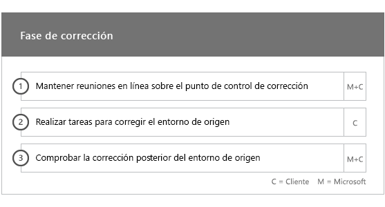

# Fases de incorporación y migración

La incorporación de Office 365 consta de cuatro fases principales: inicio, evaluación, corrección y habilitación. Puede seguir estas fases con una fase opcional de migración de datos, tal como se muestra en la figura siguiente.
  

  
Para ver las tareas detalladas para cada fase, consulte [Responsabilidades de FastTrack](fasttrack-responsibilities.md) y [Sus responsabilidades](your-responsibilities.md).
  
## Fase de inicio

Después de adquirir el número y los tipos de licencias adecuados, siga las instrucciones que se indican en el correo electrónico de confirmación de compra para asociar las licencias a la cuenta empresarial existente o nueva. 
  
- Puede obtener ayuda en el Centro de administración de Office 365 o en el [sitio de FastTrack](https://go.microsoft.com/fwlink/?linkid=780698). Para obtener ayuda en el Centro de administración de Office 365, el administrador debe iniciar sesión en él y, a continuación, hacer clic en el widget **¿Necesita ayuda?** Para obtener ayuda en el [sitio de FastTrack](https://go.microsoft.com/fwlink/?linkid=780698), inicie sesión, haga clic en **Servicios** y complete el formulario **Solicitar asistencia para Office 365**. 
    
    > [!NOTE]
    >  Si un partner aparece en su espacio empresarial de Office 365, no verá esta opción. Consulte a su partner para obtener asistencia. 
  
- Los partners también pueden obtener ayuda en el [sitio de FastTrack](https://go.microsoft.com/fwlink/?linkid=780698) en nombre de un cliente. Para ello, el partner debe iniciar sesión en el sitio, seleccionar el registro del cliente, hacer clic en **Servicios** y completar el formulario **Solicitar asistencia para Office 365**. 
    
- También puede solicitar ayuda del Centro FastTrack en el [sitio de FastTrack](https://go.microsoft.com/fwlink/?linkid=780698) en la lista de servicios disponibles para su cuenta empresarial. 
    
Durante esta fase, analizaremos el proceso de incorporación, comprobaremos los datos y estableceremos una reunión inicial.
  
Esto incluye trabajar con usted para comprender cómo quiere usar el servicio y para conocer los objetivos y los planes de la organización para impulsar el uso del servicio.
  

  
## Fase de evaluación

El administrador de FastTrack realiza con usted y con su equipo de adopción una llamada interactiva del plan de éxito. De este modo, tiene acceso a las funciones de los servicios pertinentes que adquirió, los puntos clave que necesita para lograr el éxito, la metodología para impulsar el uso del servicio y los escenarios que puede usar para aprovechar los servicios. Le ofrecemos asistencia para que diseñe un plan de éxito y le enviamos comentarios sobre las áreas fundamentales (según sea necesario).
  
Los especialistas de FastTrack trabajan con usted para evaluar su entorno de origen y los requisitos. Ejecutamos herramientas para recopilar datos y le guiamos durante la estimación de los requisitos de ancho de banda y la evaluación de los exploradores de Internet, los sistemas operativos cliente, el Sistema de nombres de dominio (DNS), la red, la infraestructura y el sistema de identidad para determinar si se deben efectuar cambios para la incorporación. 
  
Según la configuración actual, le ofrecemos un plan de corrección que lleva el entorno de origen a los requisitos mínimos para efectuar una incorporación correcta a Office 365 y, en caso necesario, para llevar a cabo una migración correcta del buzón de correo o de los datos. Le proporcionamos una serie de actividades sugeridas para aumentar el valor y la aceptación por parte de los usuarios finales. Asimismo, configuramos llamadas al punto de control para la fase de corrección.
  

  
## Fase de corrección

Debe llevar a cabo las tareas de corrección en función del entorno de origen, de modo que cumpla con los requisitos de incorporación, adopción y migración de cada uno de los servicios, según sea necesario.
  

  
También ofrecemos una serie de actividades sugeridas para aumentar el valor y la aceptación por parte de los usuarios finales. Antes de iniciar la fase de habilitación, comprobamos conjuntamente los resultados de las actividades de corrección para garantizar que está listo para continuar. 
  
Durante esta fase, el administrador de FastTrack trabaja con usted para diseñar un plan de éxito y le indica cuáles son los recursos adecuados y los procedimientos recomendados para poner el servicio a disposición de la organización y a impulsar su uso en todos los servicios.
  
## Fase de habilitación

Una vez concluidas todas las actividades de corrección, nos centramos en configurar la infraestructura básica del consumo del servicio, aprovisionar Office 365 y realizar las actividades para impulsar la adopción de servicios. 
  
## Incorporación principal

La incorporación principal implica el aprovisionamiento de servicios y la integración de espacios empresariales e identidades. También incluye pasos para proporcionar las bases para la incorporación de servicios como Exchange Online, SharePoint Online y Skype Empresarial Online. Usted y el administrador de FastTrack seguirán celebrando las reuniones de los puntos de control del plan de éxito para evaluar el progreso en relación con los objetivos y determinar qué asistencia adicional necesita.
  

  

  
> [!NOTE]
> WAP son las siglas de Proxy de aplicación web. SSL son las siglas de Capa de sockets seguros. SDS son las siglas de School Data Sync Para obtener más información sobre SDS, consulte [Le damos la bienvenida a School Data Sync de Microsoft](https://go.microsoft.com/fwlink/?linkid=871480). 
  
La incorporación de uno o más servicios elegibles puede empezar al finalizar la incorporación principal.
  
## Exchange Online

En cuanto a Exchange Online, le guiamos a lo largo del proceso para preparar la organización para usar el correo electrónico. Los pasos exactos dependen del entorno de origen y de sus planes de migración de correo electrónico. Pueden incluir instrucciones para:
  
- Configuración de las características de Exchange Online Protection (EOP) para todos los dominios habilitados para correo que se han validado en Office 365.
    
    > [!NOTE]
    > Sus registros de correo Exchange (MX) deben referirse a Office 365. 
  
- Configuración de la característica de Protección contra amenazas avanzada de Exchange Online (ATP) si forma parte de su servicio de suscripción una vez que sus registros MX apunten a Office 365. Esta característica está configurada como parte de la configuración antimalware de Protección de Exchange Online.
    
- Configuración de puertos del firewall.
    
- Configuración de DNS, incluida la detección automática necesaria, el marco de directivas de remitente (SPF) y los registros MX (si procede). 
    
- Configuración del flujo de correo electrónico entre su entorno de mensajería de origen y Exchange Online (si procede).
    
- Operación de migración de correo desde el entorno de mensajería de origen a Office 365.
    
    > [!NOTE]
    > Para obtener más información sobre la migración de datos y correo, consulte [Migración de datos](data-migration.md). 
  

  
## SharePoint Online y OneDrive para la Empresa

En cuanto a SharePoint Online y OneDrive para la Empresa, se ofrecen instrucciones para:
  
- Configuración de DNS.
    
- Configuración de puertos del firewall.
    
- Aprovisionamiento de usuarios y licencias.
    
- Configuración de las características de Entorno híbrido de SharePoint, como la búsqueda híbrida, los sitios híbridos, la taxonomía híbrida, los tipos de contenido, la creación híbrida de sitios sin intervención del administrador (solo SharePoint Server 2013), el iniciador de aplicaciones extendido, OneDrive para la Empresa híbrido y los sitios de extranet.
    
Los especialistas de FastTrack ofrecen orientación sobre la migración de datos a Office 365 mediante una combinación de herramientas y documentación, además de realizar una serie de tareas de configuración cuando corresponda y sea factible.
  

  
## OneDrive para la Empresa

En cuanto a OneDrive para la Empresa, los pasos dependen de si actualmente usa SharePoint y, si es así, de la versión que use. 
  

  
## Skype Empresarial Online

En cuanto a Skype Empresarial Online, se ofrecen instrucciones para:
  
- Configuración de puertos del firewall.
    
- Configuración de DNS.
    
- Creación de cuentas para cualquier dispositivo del sistema de la sala.
    
- Implementación de un cliente de Skype Empresarial Online compatible.
    
- Establecimiento de una configuración de servidores de dominio dividido entre el entorno de servidor local de Lync 2010, Lync 2013 o Skype Empresarial 2015 y un espacio empresarial de Skype Empresarial Online (si procede), planes de llamada, Difusión de reunión de Skype y sistema telefónico y planes de llamada (en los mercados disponibles).
    

  

  
## Microsoft Teams

En cuanto a Microsoft Teams, se ofrecen instrucciones para:
  
- Confirmación de requisitos mínimos.
    
- Configuración de puertos del firewall.
    
- Configuración de DNS.
    
- Confirmando que se ha habilitado Microsoft Teams en su espacio empresarial de Office 365.
    
- Habilitar o deshabilitar licencias de usuario.
    

  
## Power BI

En cuanto a Power BI, se ofrecen instrucciones para: 
  
- Asignación de licencias de Power BI.
    
- Implementación de la aplicación Power BI Desktop.
    
## Project Online

En cuanto a Project Online, se ofrecen instrucciones para:
  
- Comprobación de la funcionalidad básica de SharePoint que se basa en Project Online.
    
- Adición del servicio de Project Online al espacio empresarial (incluida la adición de las suscripciones a los usuarios).
    
- Configuración del grupo de recursos de empresa (ERP).
    
- Creación del primer proyecto. 
    

  
## Project Online Professional y Project Online Premium

En cuanto a Project Online Professional y Project Online Premium, se ofrecen instrucciones para:
  
- Solucionar los problemas de implementación.
    
- Asignar licencias de usuario final mediante el Centro de administración de Office 365 y Windows PowerShell.
    
- Instalar Cliente de escritorio de Project Online desde el Portal de Office 365 con la opción Hacer clic y ejecutar.
    
- Configurar las opciones de actualización mediante la Herramienta de implementación de Office.
    
- Configurar un servidor de distribución in situ único para Cliente de escritorio de Project Online, incluida la ayuda para crear un archivo configuration.xml para usarlo con la Herramienta de implementación de Office.
    
- Conectar Cliente de escritorio de Project Online a Project Online Professional o Project Online Premium.
    

  
## Yammer Enterprise

En cuanto a Yammer, se ofrecen instrucciones para habilitar el servicio de Yammer Enterprise.
  
## Office 365 ProPlus

En cuanto a Office 365 ProPlus, se ofrecen instrucciones para:
  
- Solucionar los problemas de implementación.
    
- Asignar licencias de usuario final mediante el Centro de administración de Office 365 y Windows PowerShell.
    
- Instalar Office 365 ProPlus desde el Portal de Office 365 con la opción Hacer clic y ejecutar
    
- Instalar aplicaciones de Office Mobile (como Outlook Mobile, Word Mobile, Excel Mobile y PowerPoint Mobile) en sus dispositivos de iOS, Android, o Windows Mobile. 
    
- Configurar las opciones de actualización mediante la Herramienta de implementación de Office.
    
- Configurar un servidor de distribución in situ único para Office 365 ProPlus, incluida la ayuda para crear un archivo configuration.xml para usarlo con la Herramienta de implementación de Office.
    
- Implementar mediante Microsoft System Center Configuration Manager, incluida la ayuda con la creación del empaquetado de Administrador de configuración de System Center.
    

  
## Microsoft StaffHub

En cuanto a Microsoft StaffHub, se ofrecen instrucciones para:
  
- Confirmar que se ha habilitado Microsoft StaffHub en su espacio empresarial de Office 365.
    
- Habilitar o deshabilitar licencias de usuario.
    
- Características de productos principales. 
    
- Ubicaciones de descarga de Microsoft StaffHub.
    

  

  

